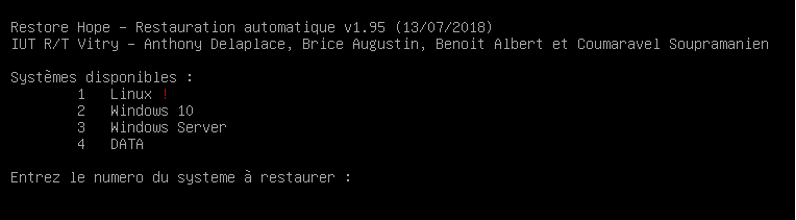

Divers
======

Identifiants de l'IUT
---------------------

Tous les OS des salles 'Réseaux' sont installés avec le compte suivant :

.. csv-table:: Identifiants
   :header: "OS", "Identifiants"
   :widths: 100, 120

   ``Debian``, ``etudiant`` / ``vitrygtr``
   ``Windows 10``, ``etudiant`` / ``vitrygtr``
   ``Windows Server 2016``, ``Administrateur`` / ``vitrygtr``

VM Préinstallées
----------------

Le répertoire ``E:\ova`` contient plusieurs VM préinstallées. Sous Linux, ce répertoire est accessible depuis le point de montage ``DATA``. 

.. csv-table:: Identifiants
   :header: "Nom", "Description"
   :widths: 100, 120

   ``debian-stretch.ova``, "Installation minimaliste de la version la plus récente de Debian Linux. Sans interface graphique (en CLI)"
   ``Windows_Server_2016.ova``, "Installation de base de la version la plus récente de Windows Server."
   "...", "D'autres VM qui vous serviront plus tard !"

Serveur FTP de l'IUT
--------------------

::

	ftp://srv-ftp/

Identifiants : ``etudiant`` / ``vitrygtr``

Serveur DNS de l'IUT
--------------------

XXX

.. _my-reference-label:

Section to cross-reference
--------------------------

This is the text of the section.

It refers to the section itself, see :ref:`my-reference-label`.

Lancer la restauration d'un OS
------------------------------

Les machines de la salle 110 (*ainsi que toutes les salles de TP 'Réseaux'*) sont équipées d’un système de restauration, baptisé ``Restore Hope``. 
Ce système permet de restaurer un des OS de la machine avec les *paramètres par défaut*, donc en effaçant toutes les modifications qui ont été faites lors des séances de TP précédentes. 

.. warning:: Avant de démarrer une séance de TP, vous devez impérativement vérifier que tous vos PC sont restaurés. 

Pour restaurer un OS particulier, démarrer (ou redémarrer) le PC puis :

#. Au démarrage, lorsque l’écran bleu (``Multiboot Grub``) apparait, sélectionner ``Restauration``
#. Le système de restauration démarre en quelques secondes et affiche un menu (voir :ref:`fig-rh` :numref:`fig-rh`)

	La présence d'un *point d'exclamation en rouge* à côté d'un OS indique que ce dernier *n'a pas été restauré*, donc que quelqu'un l'a utilisé avant vous. 
	Si l'OS que vous voulez utiliser n'est pas accompagné d'un point d'exclamation, vous n'avez pas besoin de le restaurer. Rebootez l'ordinateur avec Ctrl+Alt+Suppr et commencez à travailler immédiatement !

#. Pour restaurer un OS, entrer le numéro correspondant cet OS puis valider avec ``Entrée``
#. La restauration commence. Elle ne prend que quelques minutes et l’ordinateur s’éteindra tout seul à la fin. 

.. _fig-rh:

	Restore Hope indiquant un seul système non restauré (Linux)

A la fin de la séance de TP, vous devez impérativement restaurer les OS utilisés sur tous vos PC. Tentez votre chance à la loterie R&T et obtenez un point supplémentaire sur votre note de TP (Offre valable uniquement en fin de séance) !
