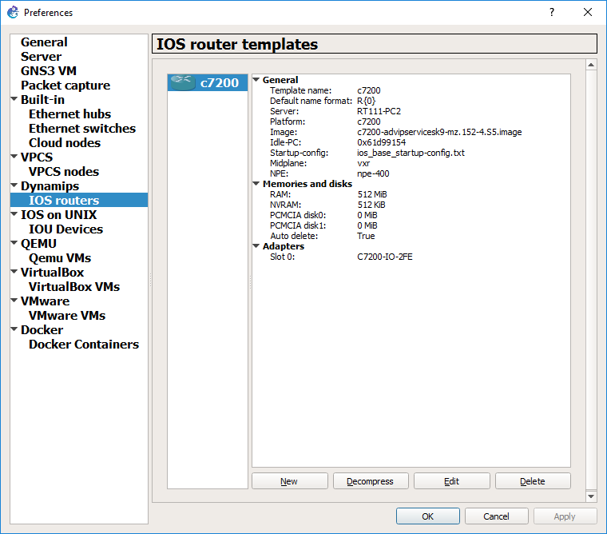
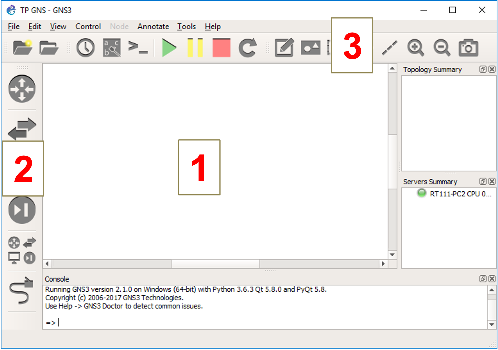
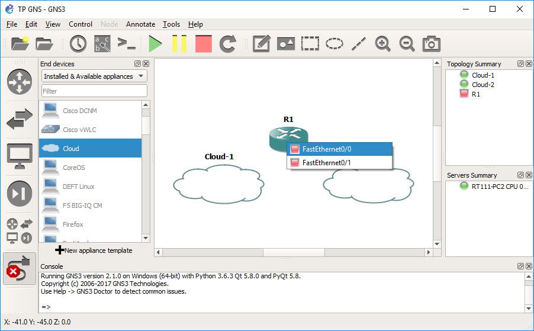

GNS3
====

Importer l'image ``IOS`` d'un routeur
-------------------------------------

Lancer GNS3 et sélectionner ``Run only legacy IOS on my computer``. 
Dans ``Host binding``, sélectionner ``127.0.0.1``. 

Si GNS3 se plaint de ne pas pouvoir se connecter à ``127.0.0.1``, cliquer sur ``Cancel``, fermer GNS3 et le relancer quelques secondes plus tard.

Télécharger l'image IOS d'un routeur Cisco ``C7200``.

.. note:: des images ISO sont disponibles sur le FTP de l'IUT. 

Ouvrir les préférences de GNS3 (``Edit`` > ``Preferences``). 

Dans ``IOS routers`` > ``New`` > ``Next`` > ``New image`` > ``Browse`` : sélectionner l'image IOS précédente. 

Cliquer sur ``Next`` pour valider les écrans suivants, jusqu'à atteindre l'écran ``Network adapters`` : dans ``slot 0`` choisir ``C7200-IO-2FE``

Ensuite, dans la partie ``Idle PC``, cliquer sur ``Idle-PC finder`` et attendre que le programme trouve une valeur adaptée. Si aucune valeur n'est trouvée au bout d'une minute, abandonner la recherche. 

Enfin, cliquer sur ``Finish``. 

.. _fig-ios-images:

	Ajout d'une image IOS dans GNS3

Interface graphique de ``GNS3``
-------------------------------

L'interface graphique de ``GNS3`` est similaire à celle de ``Packet Tracer`` :

#. Zone de travail
#. Équipements que le logiciel peut simuler
#. Outils de manipulation des équipements et des liens de la zone de travail

.. _fig-gns3-gui:

	GUI de GNS3

Les équipements disponibles sont regroupés en catégories. Pour le moment, seules les catégories suivantes vous seront utiles :

- Routers
- End Devices
- Links

Configurer ``FastEthernet 0/0`` en mode ``Accès par pont`` sur la carte ``Ethernet 3``
--------------------------------------------------------------------------------------

..
	TODO screenshot
	sinon gns3 risque d'en sélectionner une au lieu de Ethernet (bug ???)
	firewall : Test 2020 : pas nécessaire

.. warning:: Sur le PC, désactiver toutes les cartes virtuelles (liées à VirtualBox ou à VMware).  Désactiver également le pare-feu Windows.

Dans la catégorie  ``End Devices``, sélectionner un objet ``Cloud`` et le faire glisser dans la zone de travail. Ce nuage représente l'ensemble des cartes réseau du PC physique. 

Cliquer sur l'icône ``Links``. Cliquer ensuite sur le routeur, et sélectionner ``FastEthernet0/0`` (carte réseau virtuelle sur le routeur).

Enfin, cliquer sur le nuage, et sélectionner ``Ethernet 3`` (carte réseau physique sur l'hôte)

.. _fig-router-interfaces:

	Cloud pour connecter le routeur en mode ``Accès par pont``

Démarrer un routeur
-------------------

Clic droit sur le routeur dans la zone de travail > ``Start``

Accéder à la CLI d'un routeur
-----------------------------

Clic droit sur le routeur dans la zone de travail > ``Console``

