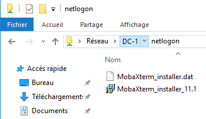
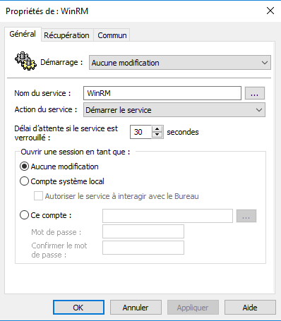
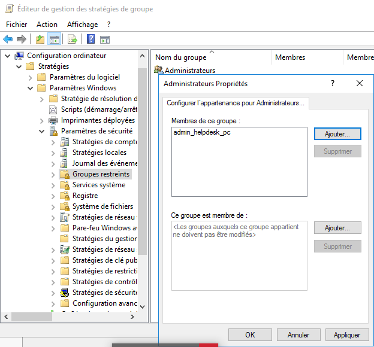
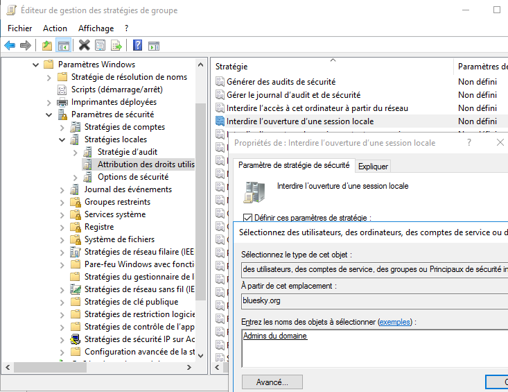

Stratégies de groupe (GPO)
==========================

Afficher les extensions de fichiers
-----------------------------------

**Type** : GPO Utilisateur

**Emplacement** :

	``Configuration utilisateur`` > ``Préférences`` > ``Paramètres du panneau de configuration`` > ``Options des dossiers``

**Paramétrage** :

Clic droit > ``Nouveau`` > ``Options des dossiers (au minimum Windows Vista)``
Décocher la case ``Masquer les extensions des fichiers dont le type est connu``

Désactiver l’accès à l’invite de commandes MS-DOS
-------------------------------------------------

**Type** : GPO Utilisateur

**Emplacement** :

	``Configuration utilisateur`` > ``Stratégies`` > ``Modèles d’administration`` > ``Système``

**Paramétrage** :

Editer la ligne ``Désactiver l’accès à l’invite de commandes``

Associer une extension de fichier à une application
---------------------------------------------------

..
	Marche plus sur TXT ! (pourquoi ?)
	Java : marche à moitié ! (03/2019)
	VBS : OK
	Extension inconnue (ex : fyi, wtf) : OK

**Type** : GPO Utilisateur

**Emplacement** :

	``Configuration utilisateur`` > ``Préférences`` > ``Paramètres du panneau de configuration`` > ``Options des dossiers``

**Paramétrage** :

Clic doit > ``Nouveau`` > ``Ouvrir avec`` et renseigner les paramètres suivants :

- Action : ``Mettre à jour``
- Extension du fichier : ``java``
- Programme associé (le chemin doit être exact ! attention aux coquilles) : ``C:\Program Files\Notepad++\Notepad++.exe``
- Cochez la case ``Par défaut``

Déployer une application via un installateur ``MSI``
----------------------------------------------------

..
	restreindre à l’UO developpeurs XXX GPO d’ordi, pas de utilisateur, créer un UO avec les ordis ? il ya deja Computers mais c un conteneur, pas un UO, et pas possible de dupliquer un objet dans deux conteneur ???
	oui créer une UO ordis et deplacer les ordis depuis le conteneur computers

.. note:: On suppose que le contrôleur de domaine se nomme ``DC-1``.

**Préparation** :

..
	TODO : généraliser DC-1

Placer l'installateur ``MSI`` dans le dossier ``\\DC-1\NETLOGON\`` du contrôleur de domaine. *``NETLOGON`` est un dossier partagé automatiquement par Windows Server. Il est accessible en lecture seule par tous les postes du domaine.*

.. _fig-netlogon:

	Le dossier NETLOGON sur le contrôleur de domaine

**Type** : GPO Ordinateur

**Emplacement** :

	``Configuration d’ordinateur`` > ``Stratégies`` > ``Paramètres du logiciel`` > ``Installation de logiciel``

**Paramétrage** :

Clic droit > ``Nouveau`` > ``Package``

Taper ``\\DC-1\NETLOGON`` dans la barre d’adresse (en haut) puis double-cliquer sur l’installateur ``MSI`` qui apparaît. 
Vérifier que le type de déploiement "``Attribué``" est bien sélectionné. 
Le paquetage doit apparaitre au bout de quelques secondes. 

..
	03/2019 : au moins une minute !

.. warning:: Plusieurs redémarrages du poste de travail peuvent être nécessaires pour que l'application soit effectivement installée ...

Connecter un lecteur réseau
---------------------------

**Type** : GPO Utilisateur

**Emplacement** :

	``Configuration utilisateur`` > ``Préférences`` > ``Paramètres Windows`` > ``Mappage de lecteurs``

**Paramétrage** :

Clic droit > ``Nouveau`` > ``Lecteur mappé``

- Dans ``Emplacement`` indiquer le chemin UNC du dossier partagé. Par exemple : ``\\DC-1\partage``
- Comme ``Lettre de lecteur``, choisir ``Utiliser : Z:``

Empêcher l'utilisation de clé USB
---------------------------------

**Type** : GPO Utilisateur

**Emplacement** :

	``Configuration utilisateur`` > ``Préférences`` > ``Paramètres de Panneau de configuration`` > ``Périphériques`` 

**Paramétrage** :

Clic droit > ``Nouveau`` > ``Périphérique``

- Action : ``Ne pas utiliser ce périphérique (désactivé)``
- Dans ``Classe de périphérique`` : cliquer sur ``...`` et sélectionner ``Contrôleurs de bus USB``

Autoriser le PC à répondre aux requêtes de ping
-----------------------------------------------

**Type** : GPO Ordinateur

**Emplacement** :

``Configuration d’ordinateur`` > ``Stratégies`` > ``Modèles d'administration`` > ``Réseau`` > ``Connexions réseau`` > ``Pare-feu Windows`` > ``Profil du domaine``

**Paramétrage** :

Éditer la ligne ``Pare-feu Windows : autoriser les exception ICMP``.

Dans la fenêtre qui s'affiche, sélectionner ``Activé``, puis cocher ``Autoriser les requêtes d'écho entrantes``.

Autoriser les flux RDP (Bureau à distance)
------------------------------------------

**Type** : GPO Ordinateur

**Emplacement** :

	``Configuration d’ordinateur`` > ``Stratégies`` > ``Paramètres Windows`` > ``Paramètres de sécurité`` > ``Pare-feu Windows avec ...`` > ``Règles de trafic entrant``

**Paramétrage** :

Clic droit > ``Nouvelle règle`` > ``Prédéfinie``

Sélectionner la règle prédéfinie ``Bureau à distance`` > ``Suivant`` (*laisser tous les autres paramètres par défaut*) > ``Terminer``

Activer le Bureau à distance
----------------------------

..
	GPO Utilisateur seul : marche pas ? visiblement non

**Type** : GPO Ordinateur

**Emplacement** :

	``Configuration d'ordinateur`` > ``Stratégies`` > ``Modèles d’administration`` > ``Composants Windows`` > ``Services Bureau à distance`` > ``Hôte de la session Bureau à distance`` > ``Connexions``

**Paramétrage** :

Éditer la ligne ``Autoriser les utilisateurs à se connecter à distance à l'aide des services Bureau à distance``.

Dans la fenêtre qui s'affiche, sélectionner ``Activer``.

Verrouiller le compte après *n* échecs
--------------------------------------

..
	http://pbarth.fr/node/240

**Type** : GPO Ordinateur

**Emplacement** :

	``Configuration Ordinateur`` > ``Stratégies`` > ``Paramètres Windows`` > ``Paramètre de sécurité`` > ``Stratégie de compte`` > ``Stratégie de verrouillage du compte``

**Paramétrage** :

Configurer le ``Seuil de verrouillage de comptes`` à la valeur souhaitée.

Activer le contrôle à distance ``PowerShell``
---------------------------------------------

..
	https://www.techrepublic.com/article/how-to-enable-powershell-remoting-via-group-policy/

Nécessite les paramétrages GPO suivants sur les postes de travail :

- :ref:`Activer WinRM<activer-winrm>`
- :ref:`Autoriser les flux WinRM<autoriser-winrm>` dans le firewall
- :ref:`Activer le service WinRM<activer-service-winrm>`
- :ref:`Démarrer le service WinRM<demarrer-service-winrm>`

.. _activer-winrm:

Activer WinRM
-------------

**Type** : GPO Ordinateur

**Emplacement** :

	``Configuration d'ordinateur`` > ``Stratégies`` > ``Modèles d’administration`` > ``Composants Windows`` > ``Gestion à distance de Windows (WinRM)`` > ``Service WinRM``

**Paramétrage** :

Éditer la ligne ``Autoriser la gestion de serveurs à distance via WinRM``. 

Dans la fenêtre qui s'affiche, sélectionner ``Activer``. 

.. _autoriser-winrm:

Autoriser les flux WinRM
------------------------

**Type** : GPO Ordinateur

**Emplacement** :

	``Configuration d’ordinateur`` > ``Stratégies`` > ``Paramètres Windows`` > ``Paramètres de sécurité`` > ``Pare-feu Windows avec ...`` > ``Règles de trafic entrant``

**Paramétrage** :

Clic droit > ``Nouvelle règle`` > ``Prédéfinie``.

Sélectionner la règle prédéfinie ``Gestion à distance de Windows`` > ``Suivant`` (*laisser tous les autres paramètres par défaut*) > ``Terminer``

.. _activer-service-winrm:

Activer le service WinRM
------------------------

**Type** : GPO Ordinateur

**Emplacement** :

	``Configuration d’ordinateur`` > ``Stratégies`` > ``Paramètres Windows`` > ``Paramètres de sécurité`` > ``Services système``

**Paramétrage** :

Éditer la ligne ``Gestion à distance de Windows (Gestion WSM)``.

Dans la fenêtre qui s'affiche, cocher ``Définir ce paramètre de stratégie`` et sélectionner ``Automatique``

.. _demarrer-service-winrm:

Démarrer le service WinRM
-------------------------

**Type** : GPO Ordinateur

**Emplacement** :

	``Configuration d’ordinateur`` > ``Préférences`` > ``Paramètres du Panneau de configuration`` > ``Services``

**Paramétrage** :

Clic droit > ``Nouveau``

Dans la fenêtre qui s'affiche, indiquer :

- Nom : ``WinRM``
- Action du service : ``Démarrer le service``

.. _fig-winrm-service:

	Propriétés du service WinRM

Gérer les groupes locaux
------------------------

..
	https://docs.microsoft.com/fr-fr/troubleshoot/windows-server/group-policy/description-of-group-policy-restricted-groups

**Type** : GPO Ordinateur

**Emplacement** :

	``Configuration d’ordinateur`` > ``Stratégies`` > ``Paramètres Windows`` > ``Paramètres de sécurité`` > ``Groupes restreints``

**Paramétrage** :

Clic droit > ``Ajouter un groupe`` > Choisir le groupe local à modifier > ``Membres de ce groupe`` > Choisir le groupe de sécurité à ajouter

.. _fig-gpo-groupesrestreints:

	Gestion du groupe local ``Administrateurs``

Restreindre l'ouverture de session
----------------------------------

**Type** : GPO Ordinateur

**Emplacement** :

	``Configuration d’ordinateur`` > ``Stratégies`` > ``Paramètres Windows`` > ``Paramètres de sécurité`` > ``Stratégies locales`` > ``Attribution des droits utilisateur``

**Paramétrage** :

Paramètres à modifier :

- ``Interdire l'ouverture de session locale``
- ``Interdire l'ouverture de session par les services Bureau à distance``

.. _fig-interdiresessionlocale:

	Interdire l'ouverture de session locale aux ``Admins du domaine``
