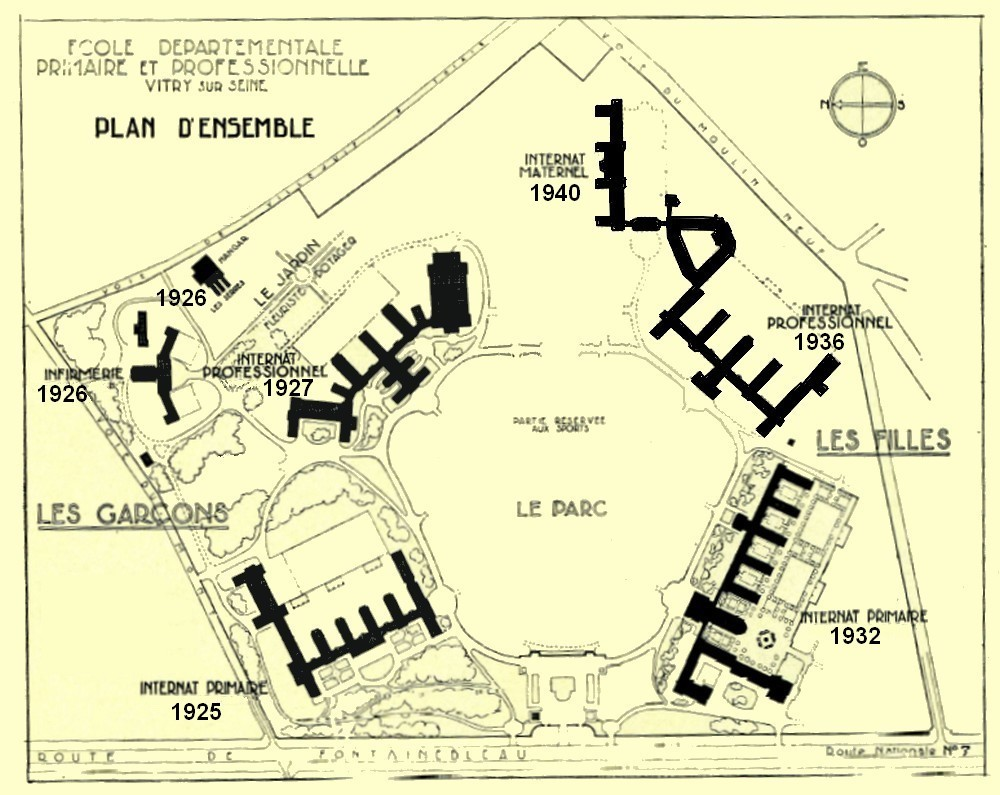

.. doc documentation master file, created by
   sphinx-quickstart on Mon Jun  7 11:28:20 2021.
   You can adapt this file completely to your liking, but it should at least
   contain the root `toctree` directive.

Welcome to doc's documentation!
===============================

this is the best news of the week. Ever

.. toctree::
   :maxdepth: 2
   :caption: Contents:

Indices and tables
==================

* :ref:`genindex`
* :ref:`modindex`
* :ref:`search`
