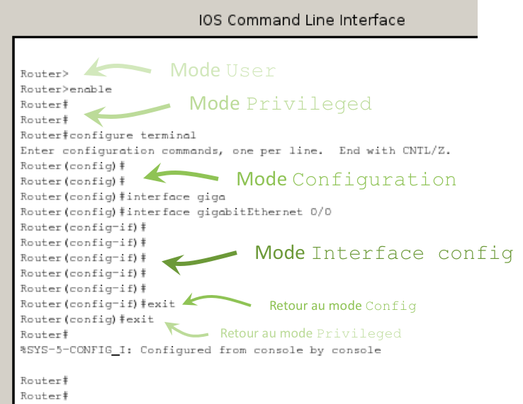
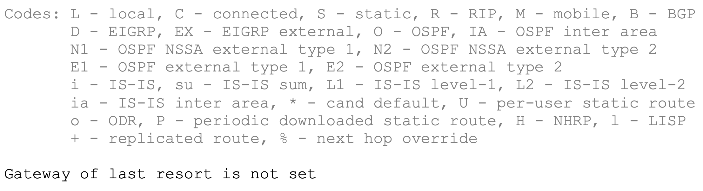
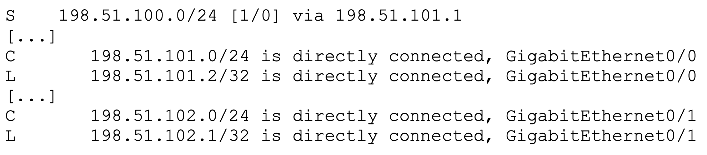
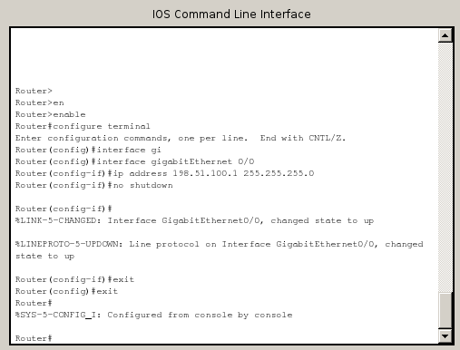

IOS Cisco
=========

.. _modes-cli-cisco:

Modes de fonctionnement de la CLI
---------------------------------

Par défaut, la CLI est en mode ``User``, symbolisé par le chevron terminant l'invité de commande :

..
	Dans ce mode, seul l'affichage d'une partie de la configuration est possible.

.. code-block::

	Router>

.. _fig-ios-modes:

	Passage d'un mode à l'autre

Pour passer en mode ``Privilégié``, il faut taper :

.. code-block::

	enable

L'invité de commande devient :

.. code-block::

	Router# 

Pour passer en mode ``Configuration``, il faut déjà être en mode ``Privilégié`` puis taper :

.. code-block::

	configure terminal

L'invité de commande devient :

.. code-block::

	Router(config)#

Pour quitter un mode et revenir au mode précédent (par exemple, passer du mode ``Configuration`` au mode ``Privilégié``), il faut taper :

.. code-block::

	exit

.. _commandes-ios:

Commandes IOS usuelles
----------------------

.. csv-table:: Commandes IOS usuelles
   :header: "Commandes", "Rôle"
   :widths: 130, 150

	``configure terminal``, "Passer en mode Configuration"
	``end`` ou ``Ctrl + D``, "Revenir au mode Privilégié"
	``enable``, "Passer du mode User au mode Privilégié"
	``erase``, ""
	``exit``, "Quitter le mode actuel"
	``hostname``, "Modifier le nom du routeur / switch"
	``interface``, ""
	``ip address``, ""
	``ip route``, ""
	``no``, ""
	``reload``, "Redémarrer l'équipement (*Les confs non enregistrées seront perdues !*)"
	``show running-config``, :ref:`show-run`
	``show ip interface brief``, :ref:`show-ip-int-br`
	``show ip route``, :ref:`show-ip-route`
	``shutdown``, ""
	``wr``, "Enregistrer la conf dans la mémoire flash"

Tab completion
--------------

Comme sous Linux, taper les premières lettres d'une commande ou d'un paramètre, puis appuyer sur ``Tab`` pour compléter la commande automatiquement. 

Commandes abrégées
------------------

Par exemple :

``sh run`` à la place de ``show running-config``

``conf t`` à la place de ``configure terminal``

Aide contextuelle
-----------------

.. code-block::

	! Ceci est un commentaire.
	! Affiche les commandes disponibles dans le mode courant :
	?

	! Affiche les paramètres de la commande show :
	show ?

L'affichage se fait de manière paginée (en plusieurs pages). Appuyer sur ``Espace`` pour afficher la suite. (Tester aussi les touches ``Entrée`` et ``q``).

Détection d'erreur dans la ligne de commande
--------------------------------------------

Le symbole ``^`` indique la position de l'erreur de syntaxe. Par exemple :

.. code-block::

	configure treminal
	           ^
	% Invalid input detected at '^' marker.

.. _show-run:

Afficher la configuration
-------------------------

.. code-block::

	show running-config

Cette commande affiche la configuration de manière paginée (en plusieurs pages). Appuyer sur ``Espace`` pour afficher la suite. (Tester aussi les touches ``Entrée`` et ``q``).

.. _show-ip-int-br:

Afficher les cartes réseau
--------------------------

.. code-block::

	show ip interface brief

Cette commande affiche également l'adresse IP de chaque carte réseau. Elle indique aussi si un câble est branché (``Protocol up``/``down``) et si la carte est activée (``Status up``/``down``) dans le système. 

Revenir à la configuration usine
--------------------------------

..
	TODO : delete flash:vlan.dat ?
	Bof au S1

.. code-block::

	erase startup-config

Puis :ref:`redémarrer l'équipement<commandes-ios>`. 

.. warning:: Répondre ``no`` aux questions posées avant et après redémarrage !

.. _show-ip-route:

Afficher la table de routage
----------------------------

..
	TODO Simplifier !!!

.. code-block::

	show ip route

..
	#sh ip route
	Codes: L - local, C - connected, S - static, R - RIP, M - mobile, B - BGP
	       D - EIGRP, EX - EIGRP external, O - OSPF, IA - OSPF inter area 
	       N1 - OSPF NSSA external type 1, N2 - OSPF NSSA external type 2
	       E1 - OSPF external type 1, E2 - OSPF external type 2
	       [...]
	       o - ODR, P - periodic downloaded static route, H - NHRP, l - LISP
	       + - replicated route, % - next hop override

	Gateway of last resort is not set

	      198.51.100.0/24 is variably subnetted, 3 subnets, 3 masks
	O        198.51.100.0/28 [110/2] via 198.51.100.33, 00:00:23, FastEthernet0/0
	C        198.51.100.32/30 is directly connected, FastEthernet0/0
	L        198.51.100.34/32 is directly connected, FastEthernet0/0

La table de routage est affichée en deux parties distinctes. 

La première partie (:numref:`fig-show-ip-route-legende`) liste toutes les origines possibles des routes. Par origine, nous entendons la façon dont cette route a été apprise. Une route peut être connue parce que :

- Elle a été ajoutée automatiquement car le routeur est directement connecté au ``subnet`` (code ``C``), ou
- Elle a été ajoutée automatiquement car l'adresse IP (``/32``) est attachée à une des cartes réseau du routeur (code ``L``), ou
- Elle a été rajoutée manuellement par l'administrateur (route statique, code ``S``), ou
- Elle a été ajoutée par un protocole de routage dynamique. *ous étudierez ce mécanisme plus tard dans l'année.*

.. _fig-show-ip-route-legende:

	Première partie de la table de routage (légende)

La seconde partie (:numref:) liste toutes les entrées de la table de routage (appelées *routes*, une par ligne). Chaque entrée comporte trois indications : le code, le *subnet* (ou préfixe) et la façon d'atteindre ce *subnet* (*Remise Directe* ou *Routage via*) :

.. _fig-show-ip-route:

	Deuxième partie : la table de routage proprement dite

Dans cet exemple (fictif), la table de routage contient donc :

- Une route statique (``S``)
- Deux entrées en *Remise directe* (``C``)
- Deux adresses IP (préfixe en ``/32``) en *Remise locale* (``L``). Ce sont les adresses IP attachées au routeur

Configurer ``FastEthernet 0/0`` en adressage dynamique persistant
-----------------------------------------------------------------

.. code-block::
	
	ip address dhcp

Cette commande n'est accessible qu'en :ref:`mode Configuration de l'interface<modes-cli-cisco>` ``FastEthernet 0/0``.

Par défaut, les interfaces des routeurs sont désactivées. La dernière étape consiste donc à :ref:`activer<activer-interface>` l'interface ``FastEthernet 0/0``.

Attribuer l'adresse IP ``198.51.100.1/24`` à l'interface ``GigabitEthernet 0/0``
-------------------------------------------------------------------------------

.. code-block::

	ip address 198.51.100.1 255.255.255.0

Cette commande n'est accessible qu'en :ref:`mode Configuration de l'interface<modes-cli-cisco>` ``FastEthernet 0/0``.

Par défaut, les interfaces des routeurs sont désactivées. La dernière étape consiste donc à :ref:`activer<activer-interface>` l'interface ``FastEthernet 0/0``.

La :numref:`fig-config-interface` montre la CLI après l'application de ces commandes. 

.. _fig-config-interface:

	Configuration d'une interface

.. _activer-interface:

Activer l'interface ``FastEthernet 0/0``
----------------------------------------

.. code-block::

	no shutdown

Cette commande n'est accessible qu'en :ref:`mode Configuration de l'interface<modes-cli-cisco>` ``FastEthernet 0/0``.

Afficher le détail des interfaces réseau
----------------------------------------

.. code-block::

	show ip interface

Exemple d'affichage :

.. code-block::
	:emphasize-lines: 1,2

	FastEthernet0/0 is up, line protocol is up
	  Internet address is 198.51.100.1/28
	  Broadcast address is 255.255.255.255
	  Address determined by non-volatile memory
	  MTU is 1500 bytes
	  [...]

Créer un couple de clés RSA de 1024 bits
----------------------------------------

.. code-block::

	crypto key generate rsa

À la question ``How many bits in the modulus [512]``, répondre ``1024``. 

.. note:: Il s'agit d'une commande du :ref:`mode Configuration<modes-cli-cisco>`.

Ajouter un utilisateur ``otabenga`` avec le mot de passe ``kongo``
------------------------------------------------------------------

..
	coloration syntaxique cisco IOS ... ?

..
	0 : mot de passe en clair
	7 : encrypted

.. code-block:: cisco

	username otabenga password 0 kongo
	! Activer l'authentification sur le routeur
	! (désactivé par défaut)
	aaa new-model

..
	activer AAA
	ou bien : line vty 0 4
	login local -> on se logge en non privilégié
	puis enable password vitrygt -> il faut faire enable (avec mot de passe) pour passer en mode priv

.. note:: Il s'agit d'une commande du :ref:`mode Configuration<modes-cli-cisco>`.
