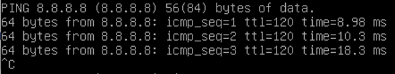
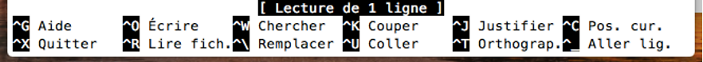
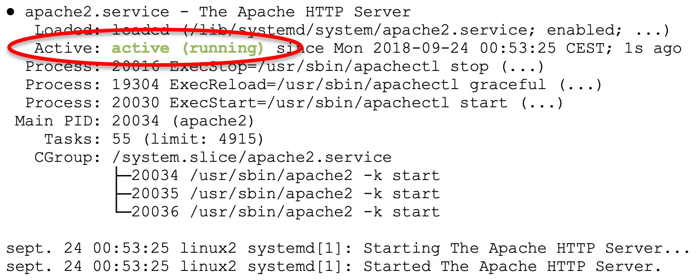
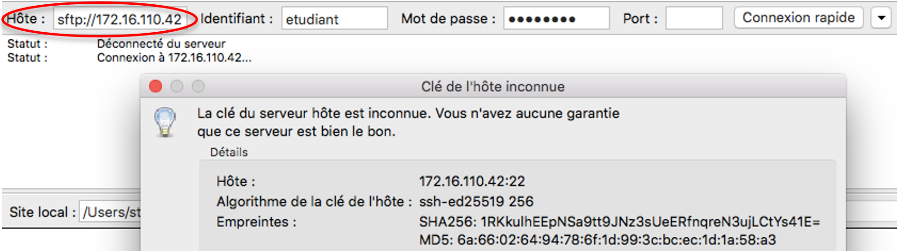
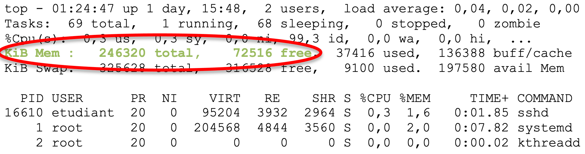
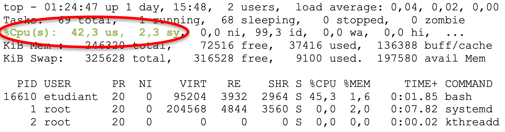
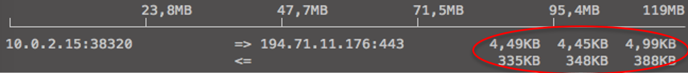

..
	ça marche
	.. sectnum::

Linux
=====

Installer une version minimaliste de Debian
-------------------------------------------

Linux en CLI (mode console, sans interface graphique) n'utilise pas la souris ! 
Tout se passe avec le clavier pour naviguer dans les menus d'installation :

- Les flèches du clavier
- La touche Tab pour naviguer dans les options
- La touche Espace pour cocher/décocher certaines options
- La touche Entrée pour valider

Sélectionner ``Install`` (et pas ``Graphical install``) et valider pour lancer l'assistant d'installation qui se déroule en quatre étapes et dure une dizaine de minutes :

Collecte des informations
"""""""""""""""""""""""""

- Language : ``French``
- Pays : ``France``
- Clavier : ``Français``
- Nom de la machine : ``debian-VotreNom``
- Domaine : ``salle110``
- Mot de passe root : ``vitrygtr``
- Nouveau compte utilisateur : ``etudiant``
- Mot de passe : ``vitrygtr``

Partitionnement
"""""""""""""""

Pour le partitionnement, choisir ``Assisté - Utiliser un disque entier``.

Sélectionner le disque à partitionner (il n'y en a qu'un). 

Choisir d'installer ``Tout le système dans une seule partition``, puis ``Terminer et appliquer les changements`` (confirmer avec ``Oui``). 

Installation du système
"""""""""""""""""""""""

L'installation de base se lance et va durer quelques minutes. 

Lorsque l'installateur vous demande s'il faut analyser un autre CD ou DVD, répondez ``Non``. 

On vous demande alors de choisir un miroir ``Debian``. Il s'agit d'un serveur de fichiers, sur internet, depuis lequel l'installateur va télécharger les applications additionnelles. *Vous verrez un peu plus tard comment installer ces applications à la demande*. 

Sélectionnez de préférence un miroir se trouvant en ``France``. En effet, il est préférable de choisir un miroir qui se trouve géographiquement proche de votre machine pour accélérer le téléchargement.

..
	Configurez ensuite le Mandataire HTTP, c'est à dire le proxy de l'IUT : 
	http://proxy.iutcv.fr:3128

A la question sur la participation à l'étude statistique sur l'utilisation des paquets, répondez ce que vous souhaitez. 

Comme nous n'installons que le système minimal, dans la fenêtre ``Sélection de logiciels``, décochez *toutes* les cases (Utilisez pour cela la touche ``Espace``). 

Finalisation
""""""""""""

Enfin, valider l'installation de ``Grub`` (un gestionnaire multiboot) sur le secteur d'amorçage du disque dur (sous Linux, ce dernier se nomme ``/dev/sda``).

L'ordinateur redémarre. *C'est prêt !*

Déterminer l'adresse IP
-----------------------

..
	ifconfig est obsolète
	https://dougvitale.wordpress.com/2011/12/21/deprecated-linux-networking-commands-and-their-replacements/

Dans un terminal, taper :

.. code-block::

	ip address show

ou (version courte) :

.. code-block::

	ip a

Les informations suivantes s'affichent :

.. code-block::
	:emphasize-lines: 8,10

	etudiant@debian-stretch:~$ ip a
	1: lo: <LOOPBACK,UP,LOWER_UP> ... state UNKNOWN ...
	    link/loopback 00:00:00:00:00:00 brd 00:00:00:00:00:00
	    inet 127.0.0.1/8 scope host lo
	       valid_lft forever preferred_lft forever
	    inet6 ::1/128 scope host 
	       valid_lft forever preferred_lft forever
	2: eth0: <BROADCAST,MULTICAST,UP,LOWER_UP> ... state UP ...
	    link/ether 08:00:27:4c:3b:d1 brd ff:ff:ff:ff:ff:ff
	    inet 172.16.110.42/24 brd 172.16.110.255 scope global eth0
	       valid_lft forever preferred_lft forever
	    inet6 fe80::a00:27ff:fe4c:3bd1/64 scope link
	       valid_lft forever preferred_lft forever

Sous Linux, les cartes ``Ethernet`` sont traditionnellement nommées ``ethX`` (où ``X`` est un chiffre). Mais sur les Linux récents, leur nom commence par ``en`` (par exemple, ``enp0s3``).

..
	Ce nom sert uniquement à identifier la carte dans le PC, en interne.

Dans cet exemple, la carte réseau se nomme ``eth0`` et l'adresse IP attachée est ``172.16.110.42``. 

..
	Remarque : le /24 qui suit l'adresse IP représente le masque de réseau (netmask). Vous étudierez son rôle plus tard.  

Lancer un ping vers l'adresse IP ``8.8.8.8``
--------------------------------------------

..
	TODO : ping windows + ping linux (deux items différents)

.. code-block::

	ping 8.8.8.8

Sous ``Windows``, cette commande envoie quatre requêtes puis s'arrête. En revanche, sous ``Linux`` l'envoi de requêtes se poursuit tant qu'on ne l'arrête pas avec la combinaison de touche ``Ctrl`` et ``C``. 

Les lignes suivantes indiquent un ping réussi :

.. _fig-ping:

	Ping réussi vers ``8.8.8.8``

Ces messages prouvent que le destinataire répond bien aux requêtes envoyées par PC. 

Tout autre message (ou une absence de message) indique un échec. 

.. _droits-root:

Exécuter une commande avec les droits ``root``
----------------------------------------------

L'exécution de certaines commandes est réservée au 'super-utilisateur' :

.. code-block::

	sudo commande

Exemples :

..
	ifdown  est la première commande exécutée avec les droits root

.. code-block::

	# Seul le root peut désactiver une carte réseau
	sudo ifdown eth0
	# Seul le root peut modifier la configuration réseau
	sudo nano /etc/network/interfaces
	# Seul le root peut redémarrer l'ordinateur
	sudo reboot

Redémarrer le système
---------------------

.. code-block::
	
	reboot

Cette commande doit être :ref:`exécutée avec les droits root<droits-root>` ...

Installer le paquetage ``apache2`` (newbie)
-------------------------------------------

Dans un terminal :

.. code-block::

	sudo apt update
	sudo apt install apache2

*Vous comprendrez le rôle de ces commandes dans les prochains TP.*

Installer le paquetage ``apache2`` (avancé)
------------------------------------------

..
	TODO Autre mémo !

Avant d'installer un paquetage, il faut toujours mettre à jour la liste des paquetages disponibles :

.. code-block::

	apt update

Cela permet au système de récupérer les informations sur les versions les plus récentes de chaque paquetage (donc éviter d'installer, par exemple, la version 2.2 d'une application alors que la version 2.3 est disponible). 

On peut ensuite procéder à l'installation :

.. code-block::

	apt install apache2

Cette commande a pour effet de télécharger la version la plus récente du paquetage, ainsi que ses dépendances (logiciels dont il a besoin pour fonctionner), de la décompresser, d'installer et de configurer les fichiers et programmes sur le système. 

Sous Debian, l'installation de logiciels se résume donc à une suite de commandes ``apt``. Les paquetages sont stockés sur un grand nombre de serveurs sur internet nommés miroirs Debian et téléchargés à la demande sur votre PC. Une connexion à internet est donc nécessaire pour installer tout paquetage. 

Ces deux commandes doivent être :ref:`exécutées avec les droits root<droits-root>` ...

Installer *automatiquement* le paquetage ``dnsutils``
-----------------------------------------------------

Par défaut, la commande ``apt`` demande à l'utilisateur de confirmer l'installation d'un paquetage :

.. code-block::

	Souhaitez-vous continuer ? [O/n] 

Pour répondre automatiquement ``Oui`` à ces questions, il suffit d'ajouter le paramètre ``-y`` à la ligne de commande :

.. code-block::

	apt install -y dnsutils 

Désinstaller le paquetage ``apache2``
-------------------------------------

.. code-block::

	apt purge apache2
	apt autoremove

Afficher les informations du paquetage ``cowsay``
-------------------------------------------------

.. code-block::

	dpkg -s cowsay

Affiche les informations suivantes :

.. code-block::
	:emphasize-lines: 2

	Package: cowsay
	Status: install ok installed
	Priority: optional
	Section: games
	Installed-Size: 88
	...
	Version: 3.03+dfsg2-3
	...
	Description: configurable talking cow
	 Cowsay (or cowthink) will turn text into happy 
	 ASCII cows, with speech (or thought) balloons. ...

Cet exemple confirme que le paquetage est installé. 

Ouvrir un terminal
------------------

Clic droit sur le ``Bureau`` > ``Applications`` > ``Emulateur de Terminal``

Afficher l'adresse de la passerelle par défaut
----------------------------------------------

La passerelle par défaut est indiquée dans la :ref:`table de routage<table-routage>`, qu'il faut afficher. 

Les informations suivantes s'affichent :

.. code-block::

	default via 172.16.110.1 dev eth0 
	172.16.110.0/24 dev eth0 proto kernel scope link src 172.16.110.42

Dans cet exemple, l'adresse de la passerelle par défaut est ``172.16.110.1``. 

.. _table-routage:

Afficher la table de routage
----------------------------

.. code-block::

	ip route

Afficher l'adresse du serveur DNS
---------------------------------

.. code-block::

	cat /etc/resolv.conf

Les informations suivantes s'affichent :

.. code-block::

	nameserver 212.27.40.240

Dans cet exemple, l'adresse du serveur DNS est ``212.27.40.240``. 

Résoudre le nom de domaine ``www.perdu.com``
--------------------------------------------

..
	TODO : Résolution inverse (TP scripts M2102)
	host 8.8.8.8

.. code-block::

	host www.perdu.com

Cette commande affiche :

.. code-block::

	www.perdu.com has address 208.97.177.124

L'adresse IP du serveur ``www.perdu.com`` est donc ``208.97.177.124``.

Effectuer une résolution DNS inverse sur l'adresse ``9.9.9.9``
--------------------------------------------------------------

.. code-block::
	
	host 9.9.9.9

Cette commande affiche :

.. code-block::

	9.9.9.9.in-addr.arpa domain name pointer dns9.quad9.net.

Le nom DNS associé à l'adresse ``9.9.9.9`` est donc ``dns9.quad9.net``.

Afficher la configuration des cartes réseau
-------------------------------------------

La configuration des cartes réseau est enregistrée dans le fichier ``/etc/network/interfaces``. Ce fichier de configuration sera lu et exécuté à chaque démarrage. 

Pour afficher son contenu, utiliser ``cat`` :

.. code-block::

	cat /etc/network/interfaces

Les informations suivantes s'affichent :

.. code-block::
	:emphasize-lines: 4

	auto lo
	iface lo inet loopback
	auto eth0
	iface eth0 inet dhcp

Dans cet exemple, la carte ``eth0`` est configurée en adressage dynamique persistant (indiqué par le mot-clé ``dhcp``).

.. _enable-eth0:

Activer la carte ``eth0``
-------------------------

..
	ajouter : ce qui s'affiche si tout va bien (même en adressage statique) + que faire si ça foire ? (ou ajouter dans TP panique)
	ajouter : si ce n’est pas le cas, vérifiez votre configuration dans le fichier /etc/network/interfaces : par exemple, "address" en anglais s’écrit avec deux "d" !

.. code-block::

	ifup eth0

Cette commande doit être :ref:`exécutée avec les droits root<droits-root>`.

En cas de succès, la commande doit afficher :

.. code-block::
	:emphasize-lines: 4

	[...]
	DHCPOFFER of 172.16.110.42 from ...
	[...]
	bound to 172.16.110.42 -- renewal in 33663 seconds.

.. _disable-eth0:

Désactiver la carte ``eth0``
----------------------------

.. code-block::

	ifdown eth0

Cette commande doit être :ref:`exécutée avec les droits root<droits-root>`.

.. _editer-fichier:

Éditer le fichier ``/etc/network/interfaces``
---------------------------------------------

Avec l'éditeur de texte ``nano`` :

.. code-block::

	nano /etc/network/interfaces

Réaliser les modifications demandées (ajout ou suppression de lignes).  

Enfin, enregistrer et quitter : 

- Appuyer simultanément sur les touches ``Ctrl`` et ``X``,
- Taper ``y`` (pour répondre ``Yes``)
- Appuyer sur ``Entrée``

Fonctions de l'éditeur de texte ``nano``
----------------------------------------

Les fonctions usuelles sont affichées en bas de la fenêtre :

.. _fig-nano:

	Raccourcis de nano

Par exemple, pour couper une ligne, il faut presser simultanément les touches ``Ctrl`` et ``k``.

Configurer la carte réseau ``eth0`` en adressage dynamique persistant
---------------------------------------------------------------------

En trois étapes : désactivation, modification, activation. 

.. warning:: Ne jamais modifier la configuration d'une carte réseau sans la désactiver au préalable !

Désactiver la carte
"""""""""""""""""""

:ref:`disable-eth0`.

Modifier la configuration
"""""""""""""""""""""""""

:ref:`editer-fichier`.

..
	Pas clair :

Effacer toutes les lignes correspondant à ``eth0`` puis ajouter :

.. code-block::

	auto eth0
	iface eth0 inet dhcp

.. warning:: Ne jamais toucher aux deux premières lignes, correspondant à la carte (virtuelle) ``lo``. 

Activer la carte
""""""""""""""""

:ref:`enable-eth0`.

En cas de succès, la commande doit afficher :

.. code-block::

	Killed old client process
	[...]
	DHCPRELEASE on eth0 to ...

Vous aurez remarqué qu'un redémarrage du PC n'est pas nécessaire pour prendre en compte les modifications : l'invocation d'un script (ici ``ifup``) suffit. 

Configurer ``eth0`` en adressage statique persistant (adresse ``203.0.113.10/24``)
----------------------------------------------------------------------------------

En trois étapes : désactivation, modification, activation. 

.. warning:: Ne jamais modifier la configuration d'une carte réseau sans la désactiver au préalable !

Désactiver la carte
"""""""""""""""""""

:ref:`disable-eth0`.

Modifier la configuration
"""""""""""""""""""""""""

:ref:`editer-fichier`.

..
	Pas clair :

Effacer toutes les lignes correspondant à ``eth0`` puis ajouter :

.. code-block::

	auto eth0
	iface eth0 inet static
		# address en anglais s'écrit avec deux d
		address 203.0.113.10/24

.. warning:: Ne jamais toucher aux deux premières lignes, correspondant à la carte (virtuelle) ``lo``. 

Activer la carte
""""""""""""""""

:ref:`enable-eth0`.

En cas de succès, la commande n'affiche rien.

..
	"sur eth0" pas clair

Configurer la passerelle par défaut (``203.0.113.1``) sur ``eth0``
-----------------------------------------------------------------

En trois étapes : désactivation, modification, activation. 

.. warning:: Ne jamais modifier la configuration d'une carte réseau sans la désactiver au préalable !

Désactiver la carte
"""""""""""""""""""

:ref:`disable-eth0`.

Modifier la configuration
"""""""""""""""""""""""""

:ref:`editer-fichier`.

Ajouter le paramètre ``gateway`` dans le bloc de configuration de ``eth0`` :

.. code-block::
	:emphasize-lines: 4

	...
	iface eth0 inet static
		address 203.0.113.10/24
		gateway 203.0.113.1

Activer la carte
""""""""""""""""

:ref:`enable-eth0`.

En cas de succès, la commande n'affiche rien.

..
	utiliser "résolveur", "serveur" c'est pas clair

Configurer le résolveur DNS (``adresse du serveur 8.8.8.8``)
---------------------------------------

:ref:`Éditer le fichier<editer-fichier>` ``/etc/resolv.conf`` et ajouter la ligne suivante :

.. code-block::

	nameserver 8.8.8.8

Il faut modifier ce fichier :ref:`avec les droits root<droits-root>`.

Fonctions d'assistance à la frappe au clavier
---------------------------------------------

.. csv-table:: Raccourcis clavier
   :header: "Fonction", "Déclencheur", "Rôle"
   :widths: 90, 80, 130

	"Rappel de commande", ``Flèche Haut`` et ``Flèche Bas``, "Faire défiler les commandes déjà tapées"
	"Edition de commande", ``Flèche Gauche`` et ``Flèche Droite``, "Corriger une commande"
   "Tab completion", Touche ``Tab``, "Compléter une commande (ou un nom de fichier/dossier) tapée partiellement"

Copier-coller
-------------

Utiliser la souris pour sélectionner le texte à copier. Appuyer sur la molette. Le texte est copié à l'emplacement actuel du curseur. 

Renommer un PC (ancien nom : ``www2``, nouveau nom : ``web2``)
--------------------------------------------------------------

En trois étapes (à effectuer :ref:`avec les droits root<droits-root>`) :

Changer le nom
""""""""""""""

.. code-block::

	hostnamectl set-hostname web2

Fichier ``hosts``
"""""""""""""""""

:ref:`Éditer le fichier<editer-fichier>` ``/etc/hosts`` et remplacer les *deux* occurrences de ``www2`` par ``web2`` (sur la deuxième ligne) : 

.. code-block::
	:emphasize-lines: 2

	127.0.0.1       localhost
	127.0.1.1       www2.localdomain      www2
	...

Validation
""""""""""

Fermer le terminal et le rouvrir. :ref:`observer-prompt` pour confirmer que les modifications ont été prises en compte. 

.. _observer-prompt:

Observer le prompt du terminal
------------------------------

Le prompt (ou invite de commande) est une chaine de caractères qui s'affiche au début de chaque ligne du terminal lorsqu'il est prêt à recevoir une commande de l'utilisateur. 

Votre prompt doit être de la forme :

.. code-block::

	etudiant@pc42:~$ 

Où :

..
	Détailler : en l'occurrence, le répertoire courant est le home

- ``etudiant`` est le nom de l'utilisateur courant (actuel)
- ``pc42`` est le nom du PC
- ``~`` indique le répertoire courant
- ``$`` indique que l'utilisateur n'a pas les droits de super-utilisateur (``root``). Dans le cas contraire, le caractère ``#`` le remplace

.. _connexion-ssh-linux:

Se connecter en SSH sur le PC ``203.0.113.10`` avec le compte ``otabenga``
--------------------------------------------------------------------------

.. code-block::

	ssh otabenga@203.0.113.10

Entrer le mot de passe de cet utilisateur et valider. 

.. warning:: Le compte ``otabenga`` doit obligatoirement exister sur le PC distant.

Si le message suivant apparait, répondre ``yes`` (vous comprendrez sa signification plus tard) :

.. code-block::

	The authenticity of host '203.0.113.10' can't be established.
	ECDSA key fingerprint is SHA256:194zDKTdbDe1FRp...0HmaZmPW0Y7sPyA.
	Are you sure you want to continue connecting (yes/no)?  

Par défaut, si l'on n'indique pas de compte, la connexion est établie avec l'utilisateur courant (celui avec lequel vous avez ouvert le terminal sur le PC local). 

.. _fermer-terminal:

Fermer un terminal
------------------

.. code-block::

	exit

ou

.. code-block::

	Ctrl + D

Fermer une connexion SSH
------------------------

Voir :ref:`fermer-terminal`.

Afficher le contenu du fichier ``/etc/hostname``
------------------------------------------------

.. code-block::

	cat /etc/hostname

Consulter le manuel de la commande ``cowsay``
---------------------------------------------

.. code-block::

	man cowsay

Pour naviguer dans la page de manuel :

.. csv-table:: Raccourcis du ``man``
   :header: "Touche", "Rôle"
   :widths: 70, 120

   ``Entrée``, "Afficher la ligne suivante"
   ``Espace``, "Afficher la *page* suivante"
   ``/motif``, "Chercher ``motif`` dans le texte"
   ``n``, Chercher le motif suivant
   ``q``, Quiter

Afficher la page ``malotru.html`` du serveur Web ``203.0.113.42``
-----------------------------------------------------------------

..
	(à l'aide d'un navigateur Web)

En GUI, il suffit de taper l'URL suivante avec n'importe quel navigateur Web :

.. code-block::

	http://203.0.113.42/malotru.html

.. _fig-requete-web:

.. figure:: images/requete-web.png

	Page Web affichée par un navigateur

En CLI :

.. code-block::

	curl http://203.0.113.42/malotru.html

.. _systemctl-status:

Afficher l'état du service ``apache2``
--------------------------------------

..
	is-active sshd indique inactive alors qu'on est en SSH !
	status sshd indique active
	puis is-active indique bien active
	bizarre

	TODO utiliser status de préférence

.. code-block::

	systemctl status apache2

Affiche les informations suivantes :

.. _fig-systemctl-status:

	Le service ``apache2`` est actif

Dans cet exemple, le service est démarré (*actif*). Tout autre message indique que le service est arrêté. 

Cette commande doit être :ref:`exécutée avec les droits root<droits-root>`.

.. _systemctl-ops:

Démarrer/arrêter/relancer le service ``apache2``
------------------------------------------------

..
	TOUJOURS vérifier l'état après (surtout start/restart)

.. code-block::
	
	systemctl start apache2

Remplacer ``start`` par :

- ``stop`` pour arrêter le service
- ``restart`` pour le relancer (équivalent d'un ``stop`` puis ``start``)

Consulter le fichier de *log* principal
---------------------------------------

..
	TODO deux mémos, "fichier de log" et "afficher en continu"

.. code-block::

	tail -f /var/log/syslog

Consulter le fichier de *log* des connexions Web
------------------------------------------------

.. code-block::

	tail -f /var/log/apache2/access.log

Pour des raisons de confidentialité, seul le ``root`` peut lire ce fichier. 

Afficher les lignes ajoutées dans un fichier
--------------------------------------------

..
	Dans Linux et pas dans Bash
	Pour être cohérent avec notions de prog vues dans M2102

.. code-block::

	tail -n 0 -f /var/log/syslog

N'affiche pas les lignes *actuellement* présentes dans le fichier, affiche seulement les *nouvelles* lignes, qui sont *ajoutées* au fur et à mesure.

Mettre à jour un OS Debian
--------------------------

.. code-block::

	apt-get update
	# Peut être très long, ne pas lancer pendant un TP !
	apt-get upgrade

Lister le répertoire ``/var``
-----------------------------

.. code-block::

	ls /var

Créer un compte utilisateur ``manu``
------------------------------------

.. code-block::

	adduser manu

Changer le mot de passe de l'utilisateur ``maelys``
---------------------------------------------------

.. code-block::

	passwd maelys

.. warning:: Seul le ``root`` ou l'utilisateur ``maelys`` peut modifier ce mot de passe. 

Se connecter en FTP sur le PC ``203.0.113.10`` avec le compte ``otabenga``
--------------------------------------------------------------------------

Voir :ref:`connexion-ftp`.

..
	XXX Titre pas cohérent avec le précédent (FTP)

Se connecter en SFTP sur ``172.16.110.42``, avec l'utilisateur ``etudiant``
---------------------------------------------------------------------------

Avec ``FileZilla``, la démarche est identique à une :ref:`connexion FTP<connexion-ftp>`. Il faut simplement préfixer l'adresse du serveur SFTP avec ``sftp://`` et ignorer l'avertissement de clé inconnue. 

.. _fig-filezilla-sftp:

	Connexion SFTP avec FileZilla

Télécharger en SFTP le fichier ``/etc/vsftpd.conf``
---------------------------------------------------

*On suppose que le fichier à télécharger est présent sur le serveur ``198.51.100.42`` et que l'on veut le placer dans ``/home/etudiant/conf/ftp.conf`` sur le PC local. On se connecte sur le serveur avec le compte ``otabenga``.*

Dans un terminal ``etudiant`` sur le PC local :

.. code-block::

	scp otabenga@198.51.100.42:/etc/vsftpd.conf /home/etudiant/conf/ftp.conf

.. warning :: Le répertoire ``/home/etudiant/conf`` doit déjà exister, et otabenga doit avoir le droit de lecture sur ``/etc/vsftpd.conf``.

Déterminer si un câble Ethernet est branché sur la carte réseau ``eth0``
------------------------------------------------------------------------

:ref:`Exécuter avec les droits root<droits-root>` :

.. code-block::
	
	ethtool eth0

Affiche les informations suivantes si un câble est branché :

.. code-block::
	:emphasize-lines: 3

	Settings for eth0:
	[...]
	Link detected: yes

Et si aucun câble n'est branché :

.. code-block::
	:emphasize-lines: 3

	Settings for eth0:
	[...]
	Link detected: no

Afficher la date dans un format personnalisé
--------------------------------------------

.. code-block::

	$ date
	vendredi 28 septembre 2018, 12:01:51 (UTC+0200)
	
	$ date +%Y-%m-%d
	2018-09-28
	
	$ date +%Hh%M
	12h01

Ajouter l'utilisateur ``maelys`` au groupe ``developpeurs``
-----------------------------------------------------------

.. code-block::

	usermod -a -G developpeurs maelys

Cette commande doit être :ref:`exécutée avec les droits root<droits-root>`.

..
	Dans Linux et pas dans Bash
	Pour être cohérent avec notions de prog vues dans M2102

Chercher un motif dans une chaine de caractères
-----------------------------------------------

.. code-block:: bash

	ligne="... Accepted password for etudiant from ..."
	echo $ligne | grep "Accepted password"

Affiche :

.. code-block::
	
	... Accepted password for etudiant from ...

Et la valeur de retour de la commande est égale à ``0``.

.. code-block:: bash

	ligne="... session opened for user etudiant ..."
	echo $ligne | grep "Accepted password"

N'affiche rien et la valeur de retour de la commande est différente de ``0``.

Afficher la quantité de mémoire vive disponible
-----------------------------------------------

.. code-block::
	
	top

Affiche les informations suivantes :

.. _fig-top:

	Commande ``top``

Ici, le système dispose d'un total de ``246320 KiB`` de RAM. ``72516 KiB`` sont encore disponibles, le reste est utilisé. 

``top`` affiche ensuite la liste des processus du système, classés en fonction du CPU utilisé. Pour classer en fonction de la quantité de mémoire utilisée, appuyer sur ``Shift  + F``,  sélectionner ``%MEM``, valider avec ``s`` puis quitter avec ``q``. 

Pour quitter ``top``, taper ``q``. 

Afficher le CPU utilisé
-----------------------

.. code-block::
	
	top

Affiche les informations suivantes :

.. _fig-top-cpu:

	Commande ``top``

Ici, le CPU est utilisé à plus de 40%. 

``top`` affiche ensuite la liste des processus du système, classés en fonction du CPU utilisé. 

Pour quitter ``top``, taper ``q``.

Tuer tous les processus nommés ``dhclient``
-------------------------------------------

.. code-block::

	killall dhclient

Résoudre un problème de droits d'accès sur un fichier
-----------------------------------------------------

.. warning:: Autant que possible, ne pas modifier les droits par défaut sur le fichier, ni son propriétaire ou son groupe.

Par exemple, on veut autoriser l'utilisatrice ``maelys`` à lire le fichier ``Diagnoser.py`` dont les propriétés sont les suivantes :

.. code-block:: bash

	ls -l Diagnoser.py
	-rw-r----- 1 etudiant developpeurs 0 sept. 28 .. Diagnoser.py

..
	Dans fichier docx, couleurs différentes pour les bits user/group/other

On voit qu'il appartient à l'utilisateur ``etudiant`` et au groupe ``developpeurs``. ``etudian`` a des droits de lecture et écriture (``rw-``), le groupe ``developpeurs`` a un accès en lecture seule (``r--``), les autres n'ont aucun accès (``---``). 

``maelys`` n'a pas accès au fichier :

.. code-block:: bash

	$ cat Diagnoser.py
	cat: Diagnoser.py: Permission non accordée

Cela s'explique par le fait qu'elle ne fait pas partie du groupe ``developpeurs`` :

.. code-block:: bash

	$ groups maelys
	maelys : cdrom sudo audio video plugdev netdev bluetooth

Le groupe ``developpeurs`` n'apparait pas dans la liste. Il faut donc l'ajouter, et ``maelys`` aura accès au fichier. 

..
	https://www.cyberciti.biz/tips/check-unix-linux-configuration-file-for-syntax-errors.html

..
	Reformulé : fichier de conf __d'un serveur__

Déceler une erreur de syntaxe dans un fichier de configuration
--------------------------------------------------------------

Au moment du (re)démarrage du service, une erreur peut parfois s'afficher :

.. code-block::

	$ sudo systemctl restart networking
	Job for networking.service failed because the control process exited with error code.
	See "systemctl status networking.service" and "journalctl -xe" for details.

Malheureusement, ce n'est pas toujours le cas. Pour déterminer de manière fiable qu'un service a bien (re)démarré, il faut :ref:`afficher son état<systemctl-status>`.

Pour en savoir plus sur la raison pour laquelle un service n'a pas pu démarrer, on peut afficher le journal :

.. code-block::
	:emphasize-lines: 5,7

	$ sudo journalctl -u networking
	...
	sept. 24 02:04:21 linux2 systemd[1]: Stopping Raise network ... 
	sept. 24 02:04:21 linux2 ifdown[20547]: ifdown: 
	/etc/network/interfaces:4: unknown or no method and no inherits keyword specified
	sept. 24 02:04:21 linux2 ifdown[20547]: ifdown:
	couldn't read interfaces file "/etc/network/interfaces" ...
	sept. 24 02:04:21 linux2 systemd[1]: Failed to start ...
	...

On voit ici que le script n'a pas réussi à lire le fichier de configuration des cartes réseau. Plus intéressant encore, le message précise que l'erreur se trouve quelque part à la ligne 4. Il suffit alors d\':ref:`éditer le fichier<editer-fichier>` en question et de scruter la ligne 4 pour déceler l'erreur. 

Parfois le message d'erreur ne comporte aucune indication utile pour localiser l'erreur :

.. code-block::
	:emphasize-lines: 5

	$ sudo journalctl -u vsftpd
	...
	sept. 24 02:05:57 linux2 systemd[1]: Started vsftpd FTP server.
	sept. 24 02:05:57 linux2 systemd[1]: vsftpd.service: 
	Main process exited, code=exited, status=2/INVALIDARGUMENT
	sept. 24 02:05:57 linux2 systemd[1]: vsftpd.service: 
	Unit entered failed state.
	sept. 24 02:05:57 linux2 systemd[1]: vsftpd.service: 
	Failed with result 'exit-code'.

Dans ce cas, il faut démarrer le serveur dans le terminal pour visualiser les erreurs directement :

.. code-block::

	sudo vsftpd

Dans cet exemple, le serveur refuse de se lancer en invoquant la raison suivante :

.. code-block::

	500 OOPS: bad bool value in config file for: local_enable

..
	regarder dans syslog aussi (eg serveur dhcp)

On comprend alors qu'il y a un problème avec le paramètre ``local_enable`` dans le fichier de configuration de ``vsftpd`` ...

Activer le routage
------------------

Seul le :ref:`root<droits-root>` peut réaliser cette opération. 

:ref:`Éditer le fichier<editer-fichier>` ``/etc/sysctl.conf`` et décommenter la ligne suivante :

.. code-block::

	#net.ipv4.ip_forward=1

Valider les modifications :

.. code-block::

	sysctl -p

Ajouter une route pour le réseau ``203.0.113.0/24`` passant par ``192.0.2.254``
-------------------------------------------------------------------------------

Seul le :ref:`root<droits-root>` peut réaliser cette opération. 

.. code-block::

	ip route add 203.0.113.0/24 via 192.0.2.254

..
	XXX commande persistante !
	iface eth0 inet [...]
	[...]
	# Quand la carte est activée, ajouter une route
	up ip route add 203.0.113.0/24 via 192.0.2.254
	# Quand la carte est désactivée, retirer la route
	down ip route del 203.0.113.0/24 via 192.0.2.254

.. warning:: Cette entrée dans la table de routage disparaitra après un redémarrage. 

Supprimer la route pour ``203.0.113.0/24``
------------------------------------------

..
	XXX persistante !

.. code-block::

	ip route del 203.0.113.0/24

Dézipper l'archive ``tp2.zip``
------------------------------

.. code-block::

	unzip tp2.zip

Observer les flux qui passent sur ``eth0``
------------------------------------------

.. code-block::

	iftop -i eth0 -P -N -n -B -f "udp and port 6000"

..
	-P turn on port dispay
	-N do not resolve port number
	-B byte not bit
	-f filtre
	-n do not resolve hostnames

	"udp and port 6000"

..
	XXX pas possible vu le filtre !

Affiche, par exemple, pendant le téléchargement d'un ISO de Debian :

.. _fig-iftop:

	iftop en action

Pour chaque flux, la flèche (``=>`` ou ``<=``) indique la direction. 

Dans l'exemple, on a un premier flux émis par ``10.0.2.15`` à destination de ``194.71.11.176``, et un second flux dans l'autre direction. 

Les valeurs à droite indiquent le débit moyen (en ``Ko/s``) observé pendant les 2, 10 et 40 dernières secondes, respectivement.  

Dans l'exemple, le débit moyen du premier flux est de ``4,99 Ko/s`` et celui du second est de ``388 Ko/s``, respectivement (sur les 40 dernières secondes). 

Configurer un taux de perte de 5% sur la carte ``eth42``
--------------------------------------------------------

.. code-block::

	tc qdisc add dev eth42 root netem loss 5%

Afficher la configuration actuelle :

.. code-block::

	tc qdisc show dev eth42 

Effacer la configuration actuelle :

.. code-block::

	tc qdisc del dev eth42 root netem

Régler la date et l'heure 
-------------------------

..
	timedatectl
	https://www.jbnet.fr/systeme/linux/debian-ntp-systemd-timesyncd-service-et-timedatectl.html

:ref:`Relancer le service<systemctl-ops>` ``systemd-timesyncd``.

Établir une connexion TCP sur le port ``21`` du serveur ``203.0.113.42``
------------------------------------------------------------------------

.. code-block::

	nc 203.0.113.42 21

Si une application écoute sur le port 21 de la machine distante, chaque ligne tapée au clavier lui sera transmise. *Dans le cas contraire, la connexion est refusée.*

Toutes les réponses de l'application distante s'afficheront dans le terminal. 

Créer un couple de clés RSA pour l'utilisateur ``otabenga``
-----------------------------------------------------------

Ouvrir une session avec l'utilisateur ``otabenga`` puis :

..code-block::

	ssh-keygen

Valider les paramètres par défaut en appuyant sur ``Entrée``.

..
	Virer cette partie, vu en CM
Cette commande génère un couple de clés qui sont stockées dans le répertoire ``~/.ssh/`` :
- Une **clé privée** (fichier ``id_rsa``) : cette clé est secrète, seul l'utilisateur ``otabenga`` doit la connaitre. 
- Une **clé publique** (fichier ``id_rsa.pub``) : il s'agit d'une clé destinée à être connue de tous. L'utilisateur ``otabenga`` va devoir la distribuer sur tous les serveurs SSH auquel il veut se connecter. 

.. note:: ``~`` est une variable de shell qui représente le répertoire personnel de l'utilisateur. Dans cet exemple, il s'agit de ``/home/otabenga/``.

Exécuter la commande ``free -h`` en SSH sur le serveur ``198.51.100.42``
------------------------------------------------------------------------

.. code-block::
	
	ssh admin@198.51.100.42 "free -h"

Exécuter *plusieurs* commandes en SSH sur le serveur ``198.51.100.42``
----------------------------------------------------------------------

Créer  un fichier ``commandes.txt`` contenant les commandes à exécuter. 

Par exemple :

.. code-block::

	cat > commandes.txt << EOF
	id
	uname -a
	free -h
	df -h
	EOF

Pour exécuter ces commandes en "batch" (c’est-à-dire en une seule connexion SSH) :

.. code-block::

	ssh admin@198.51.100.42 < commandes.txt

Émettre un son de 1000 Hz
-------------------------

.. code-block::

	beep -f 1000

Se connecter sur le port TCP ``42`` de ``8.8.8.8``
--------------------------------------------------

.. 
	confusion avec > /dev/null (commande muette)

.. code-block:: bash

	# Abandon après deux secondes (-w 2)
	# Terminer dès que la connexion est établie (-q 0)
	nc 8.8.8.8 42 -q 0 -w 2 < /dev/null

.. note:: Retourne ``0`` en cas de succès.

Répertoire des pages Web
------------------------

Les pages Web publiées par un serveur ``Apache`` ou ``NGINX`` doivent être placées dans le répertoire :

.. code-block::

	/var/www/html
