Packet Tracer
=============

Lancer ``Packet Tracer``
------------------------

Cliquer sur ``Guest Login``, fermer le navigateur qui s'ouvre automatiquement, patienter quelques secondes puis cliquer sur ``Confirm Guest``.

.. _fig-guest-login:

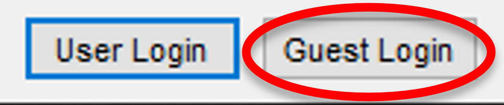

	Login invité

Alternativement, il est possible d'ouvrir ``Packet Tracer`` avec son compte ``Cisco NetAcad``.

.. _packet-tracer-gui:

Interface graphique
-------------------

La GUI de ``Packet Tracer`` se compose de trois zones :

#. Zone de travail
#. Équipements que le logiciel peut simuler
#. Outils de manipulation des équipements et des liens de la zone de travail

.. _fig-packet-tracer:

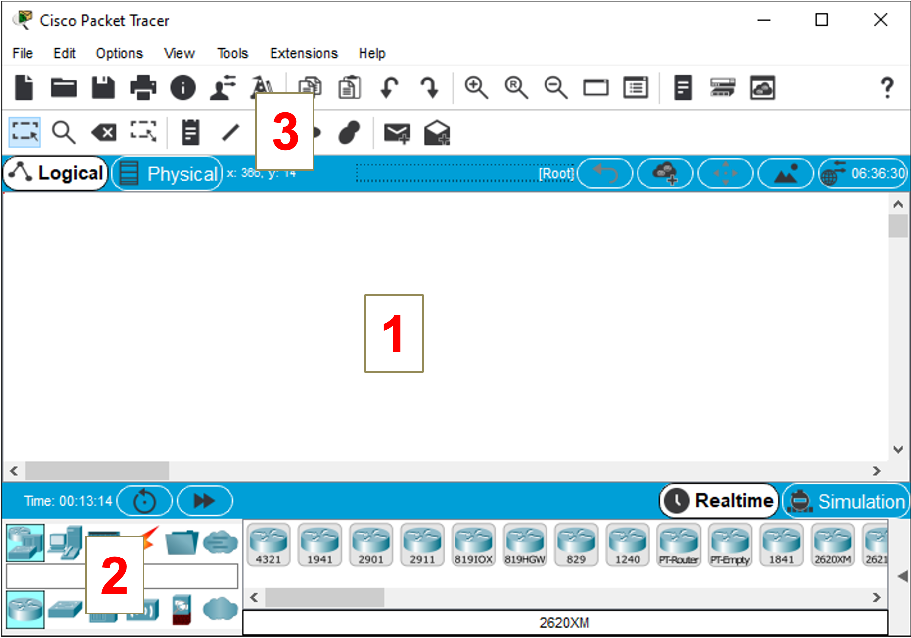

	GUI de Packet Tracer

Les équipements disponibles sont regroupés en catégories. Pour le moment, seules les catégories suivantes vous seront utiles :

- ``Network Devices / Routers``
- ``Network Devices / Switches``
- ``End Devices``
- ``Connections``

Câbler les équipements
----------------------

Suivant l'équipement à configurer, les interfaces réseau sont nommées différemment :

..
	carte réseau, interface réseau, port, carte Ethernet ... homogénéiser

.. csv-table:: Nommage des interfaces réseau
   :header: "Équipement", "Nom des interfaces réseau"
   :widths: 100, 300

	"PC", ``FastEthernet0``
	"Switch 2960", ``FastEthernet 0/0``, ``FastEthernet 0/1``, jusqu'à ``FastEthernet 0/24``
	"Routeur 2901", ``GigabitEthernet 0/0`` et ``GigabitEthernet 0/1``

Pour relier deux équipements avec un câble Ethernet, sélectionner le type de câble (câble droit ou croisé en cuivre) et cliquer sur le premier équipement. 

..
	Cette liste concerne toutes les interfaces de communication, donc pas uniquement les interfaces Ethernet.

La liste de ses interfaces apparait. Sélectionner l'interface Ethernet appropriée. 

.. _fig-cablage-pc:

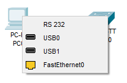

	Liste des interfaces d'un PC

Cliquer ensuite sur le second équipement, puis sélectionner l'interface Ethernet où brancher l'autre extrémité du câble. 

.. _fig-cablage-sw:

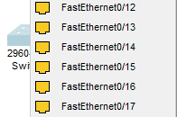

	Liste des interfaces d'un switch 2960 (extrait)

Pour débrancher un câble, utiliser la touche clavier ``Suppr`` ou le bouton ``Delete`` (Zone 3 de la :ref:`GUI<packet-tracer-gui>`).

Configuration IP d'un PC
------------------------

- **Adresse IP et masque** : Cliquer sur le PC > Onglet ``Config`` > ``FastEthernet0``
- **Passerelle** : Cliquer sur le PC > Onglet ``Config`` > ``Global`` > ``Settings`` > Paramètre ``gateway``

Attribuer une adresse IP à la carte ``GigabitEthernet 0/0`` d'un routeur
------------------------------------------------------------------------

Cliquer sur le routeur > Onglet ``Config`` > ``GigabitEthernet 0/0``

Configurer l'adresse IP et le masque. 

Activer la carte ``GigabitEthernet 0/0`` d'un routeur
-----------------------------------------------------

Cliquer sur le routeur > Onglet ``Config`` > ``GigabitEthernet 0/0`` > Cocher la case ``On``

Ajouter une route pour le réseau ``203.0.113.0/24`` passant par ``192.0.2.1``
-----------------------------------------------------------------------------

..
	Clarifier network, mask et next hop

Cliquer sur le routeur > Onglet ``Config`` > Bouton ``Static``, indiquer le réseau et le *next hop* et cliquer sur ``Add``.

.. _fig-packet-tracer-static:

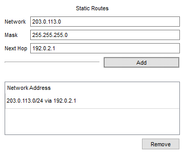

	Ajout d'une route statique

Ouvrir un terminal sur un PC
----------------------------

Cliquer sur le PC > Onglet ``Desktop`` > ``Command Prompt``

Taper ``?`` pour afficher la liste des commandes disponibles. 

Accéder à la CLI d'un équipement Cisco
--------------------------------------

Cliquer sur l'équipement > Onglet ``CLI``

.. warning:: Si la question ``Continue with configuration dialog?`` s'affiche, répondre ``no``.

.. _gerer-scenarios:

Gérer les scénarios
-------------------

Cliquer sur le triangle en bas à droite de la fenêtre principale pour faire apparaître le Panneau de scénarios de simulation. 

.. _fig-panneau-simulation:

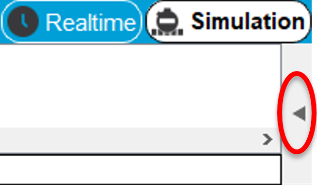

	Ouverture du Panneau de scénarios de simulation

Pour créer un nouveau scénario : ``New``

Pour supprimer le scénario actuel : ``Delete``

.. _fig-gerer-scenarios:

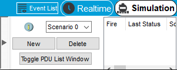

	Gestion des scénarios de simulation

.. _preparer-scenario:

Préparer un scénario de ping entre PC1 et PC2
---------------------------------------------

Cliquer sur ``Add Simple PDU`` dans la zone 3 de la :ref:`GUI<packet-tracer-gui>`.

.. _fig-add-simple-PDU:

	Add simple PDU

Le curseur prend la forme d'une enveloppe. 
Cliquer sur PC1 (émetteur du ping), puis sur PC2 (destinataire). 

Penser à :ref:`effacer les scénarios précédents<gerer-scenarios>` pour éviter de surcharger votre espace de travail. 

.. _mode-simu:

Passer en mode ``Simulation``
-----------------------------

En bas à droite de la fenêtre principale, cliquer sur l'icône représentant un chronomètre :

.. _fig-mode-simulation:

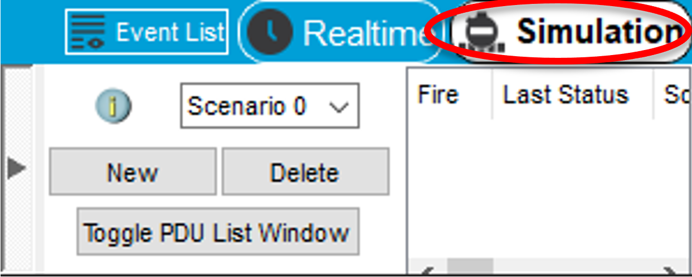

	Mode Simulation

Le mode ``Simulation`` permet de jouer un scénario étape par étape (Zone 1).

A chaque étape, il permet d'observer :

- Le trajet d'un message (par exemple, un ping) dans le réseau (Zone 2)
- Les décisions prises par chaque équipement traversé (Zone 3)

.. _fig-pt-simulation:

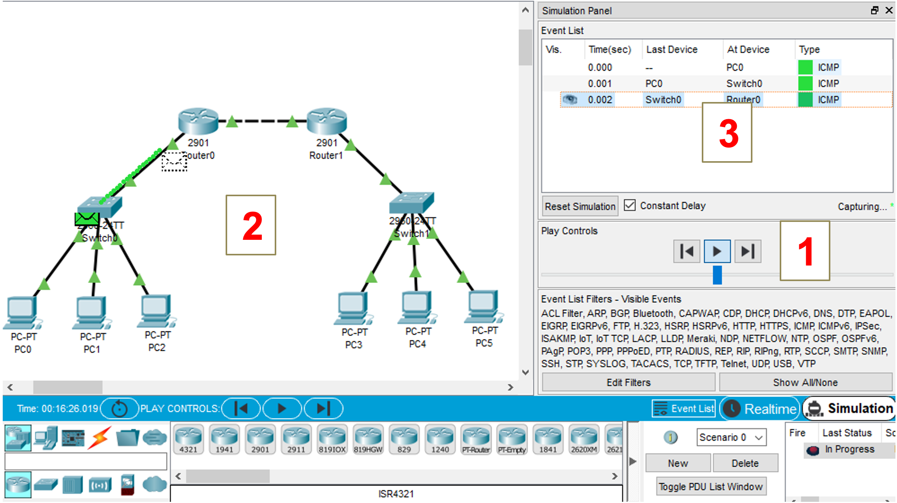

	Mode Simulation avec un scénario de ping pas-à-pas

Lancer un ping pas-à-pas entre PC1 et PC2
-----------------------------------------

Il faut déjà avoir :ref:`préparé un scénario de ping<preparer-scenario>` entre ces deux PC et être :ref:`passé en mode Simulation<mode-simu>`.

Cliquer sur ``Capture / Forward``

.. _fig-capture-forward:

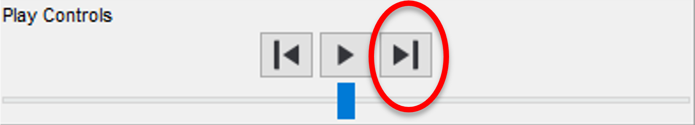

	Gestion de la simulation

A chaque clic sur ce bouton, le ping traverse un lien dans le réseau et s'arrête sur l'équipement suivant. 

.. warning:: Si un message d'erreur "*Buffer Full*" s'affiche pendant la simulation, cliquer sur ``Options`` > ``Preferences`` > ``Miscellaneous`` > ``Simulation`` > ``Buffer Full Action : Auto Clear Event List``

Observer le contenu d'une trame
-------------------------------

:ref:`En mode Simulation<mode-simu>`, pendant le déroulement d'un scénario, cliquer sur l'endroit où l'on veut observer le paquet :

.. _fig-simulation-events:

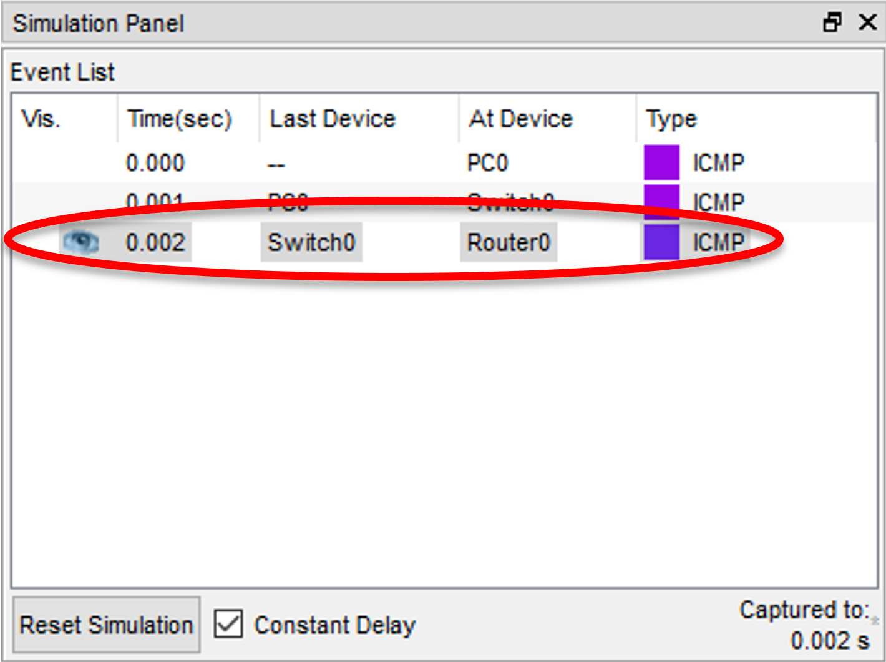

	Evènements de la simulation

*Dans cet exemple, on observe la trame au moment où elle arrive sur Router0.*

Le contenu du message s'affiche :

.. _fig-pt-contenu-ping:

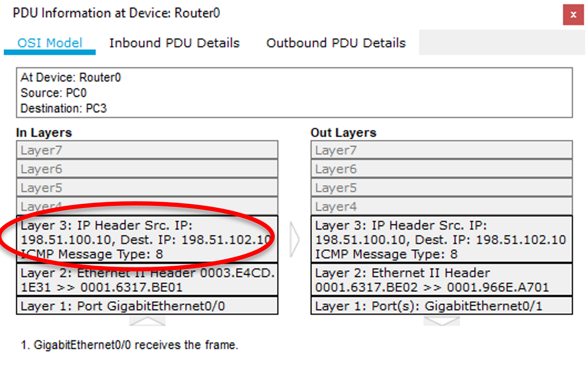

	Contenu d'un ping entre deux PC, capturé sur Router0

Les entêtes de tous les protocoles présents dans le message sont listés. 

En particulier, l'entête ``Layer 3`` correspond au protocole ``IP``, qui comprend, entre autres les adresses IP de l'émetteur et du destinataire du message. 

Alternativement, dans la zone de travail, on peut cliquer sur l'enveloppe qui décore un équipement pour afficher son contenu. 
