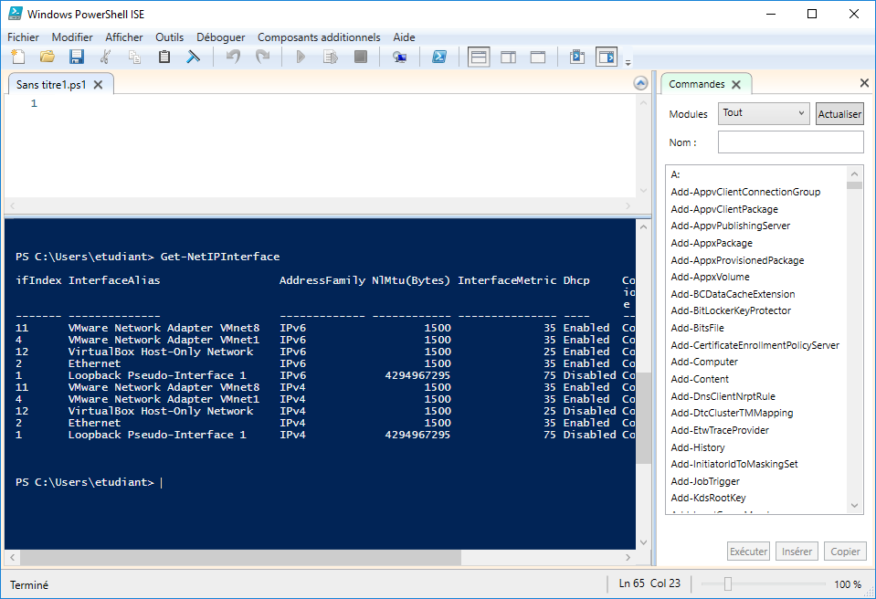

PowerShell
==========

.. _powershell-ise:

Ouvrir l'interpréteur PowerShell
--------------------------------

Dans ``Cortana``, taper  ``powershell`` puis cliquer sur ``Windows Powsershell ISE``.

.. _fig-powershell-ISE:

	Powershell Integrated Scripting Environment (ISE)

Créer un script
---------------

Dans le ``PowerShell ISE``, cliquer sur le bouton ``Nouveau`` puis sur ``Enregistrer`` pour nommer le script. 
Un script PowerShell porte l'extension ``PS1``.

Exécuter un script
------------------

Ouvrir le script dans le :ref:`PowerShell ISE<powershell-ise>` puis cliquer sur le bouton ``Exécuter le script`` ou appuyer sur ``F5``.

Autoriser l'exécution des scripts
---------------------------------

.. code-block:: powershell

	Set-ExecutionPolicy -ExecutionPolicy Bypass

*L'autorisation est définitive et valable pour l'exécution de tous les scripts à partir de maintenant.*

..
	Aide ? Get-Help (bof, même pas de descriptif de Test-Connection)
	Get-Member (plus tard)

Liste des Cmdlets courantes
---------------------------

.. csv-table:: Cmdlet courantes
   :header: "Cmdlet", "Rôle"
   :widths: 150, 150

   ``Get-NetAdapter``, ""
   ``Get-NetIPconfiguration``, ""
   ``Get-NetIPAddress``, ""
   ``Get-NetRoute``, ""
   ``Get-DnsClientServerAddress``, ""
   ``Get-Help``, ""
   ``Restart-Computer``, ""

Configurer l'adresse IP ``203.0.113.42/24`` sur la carte réseau ``Ethernet 42``
-------------------------------------------------------------------------------

.. code-block:: powershell
	
	New-NetIPAddress –InterfaceAlias "Ethernet 42" –IPAddress 203.0.113.42 –PrefixLength 24

.. determiner-index:

Déterminer l'identifiant (index) de la carte réseau ``Ethernet 42``
-------------------------------------------------------------------

.. code-block:: powershell

	Get-NetAdapter -Name "Ethernet 42"

Affiche :

.. code-block::

	Name          InterfaceDescription    ifIndex Status    MacAddress       
	----          --------------------    ------- ------    ----------       
	Ethernet 42   Intel(R) PRO/1000            12 Up        08-00-27-52-9B-E4

Dans cet exemple, l'index de la carte réseau est ``12``. 

Configurer l'adresse du serveur DNS
-----------------------------------

Il faut d'abord :ref:`déterminer l'identifiant (index)<determiner-index>` de la carte réseau utilisée. 

.. code-block:: powershell

	Set-DNSClientServerAddress –interfaceIndex 12 –ServerAddresses ("203.0.113.42")

Créer l'utilisateur ``Malotru``
-------------------------------

..
	$Password = Read-Host -AsSecureString -Prompt "Entrez"
	New-LocalUser "User03" -Password $Password -FullName "Third User" -Description "Description of this account."

..
	TODO : ajouter commentaires pour bien faire comprendre que c'est deux lignes différentes

.. code-block:: powershell

	$Password = Read-Host -AsSecureString
	New-LocalUser "Malotru" -Password $Password

Ajouter l'utilisateur ``Malotru`` au groupe ``Officiers``
---------------------------------------------------------

.. code-block:: powershell

	Add-LocalGroupMember -Group "Officiers" -Member "Malotru"

Créer le dossier ``C:\Chevalier``
---------------------------------

.. code-block::
	
	New-Item "C:\Chevalier" -ItemType directory

Créer le fichier ``deepblue.txt`` dans le dossier ``C:\Chevalier``
------------------------------------------------------------------

.. code-block:: powershell

	New-Item "C:\Chevalier\deepblue.txt" -ItemType file

Partager le dossier ``C:\Chevalier``
------------------------------------

.. code-block:: powershell

	New-SmbShare -name "Chevalier" -Path "C:\Chevalier"

Télécharger le fichier à l'URL ``http://dl.free.fr/oysxphiPd``
--------------------------------------------------------------

..
	Si https, invoke-X utilise TLS 1.1 !!!
	Forcer :
	[Net.ServicePointManager]::SecurityProtocol = [Net.SecurityProtocolType]::Tls12

.. code-block:: powershell

	$url = "http://dl.free.fr/oysxphiPd"
	Invoke-WebRequest -Uri $url -UseBasicParsing -OutFile master.zip

Se déplacer dans le répertoire personnel d'un utilisateur
---------------------------------------------------------

.. code-block:: powershell

	cd ~

Dézipper l'archive ``master.zip``
---------------------------------

.. code-block:: powershell

	Expand-Archive master.zip

Demander un nouveau bail DHCP
-----------------------------

.. code-block::

	ipconfig /renew

.. desactiver-proxy:

Désactiver le proxy
-------------------

.. code-block::

	netsh winhttp reset proxy

Activer la gestion à distance via PowerShell (``WinRM``)
--------------------------------------------------------

Dans une CLI PowerShell avec les droits ``Administrateur`` :

.. code-block:: powershell

	Enable-PSRemoting -Force

.. code-block::

	Si l'activation s'est bien passée, le message suivant s'affiche :
	WinRM a été mis à jour pour recevoir des demandes.
	Le type du service WinRM a été correctement modifié. 
	Le service WinRM a démarré. 

	WinRM a été mis à jour pour la gestion à distance.
	Exception de pare-feu WinRM activée.

Démarrer une session PowerShell sur ``PC-DE-MALOTRU``, à partir de ``SRV-5``
----------------------------------------------------------------------------

.. code-block::

	Enter-PSSession -ComputerName PC-DE-MALOTRU

La connexion tente de passer par le proxy, si ce dernier est configuré. Penser à le :ref:`désactiver<desactiver-proxy>`. 

Avant la connexion, le prompt PowerShell ressemblait à :

.. code-block::

	PS C:\Users\[...]> 

A présent il devient :

.. code-block::

	[PC-DE-MALOTRU]: PS C:\Users\[...]> 

*Toutes les commandes tapées seront exécutées sur PC-DE-MALOTRU et non pas sur l'ordinateur local.*

Renommer un PC en ``PC-DE-MALOTRU``
-----------------------------------

.. code-block:: powershell

	Rename-Computer -NewName "PC-DE-MALOTRU"

Installer le rôle ``AD-Domain-Services``
----------------------------------------

.. code-block:: powershell

	Install-WindowsFeature -Name AD-Domain-Services –IncludeManagementTools

Créer le domaine ``heisenberg.org``
-----------------------------------

.. code-block:: powershell

	Install-ADDSForest –DomainName "heisenberg.org"

Ajouter ``PC-MALOTRU`` dans le domaine ``heisenberg.org``
---------------------------------------------------------

Sur ``PC-MALOTRU`` :

.. code-block::

	Add-Computer -DomainName heisenberg.org -Credential Administrateur@heisenberg.org

Créer une OU ``Tijuana`` dans l'OU ``Mexico``
---------------------------------------------

.. code-block:: powershell

	# Créer l'OU Mexico dans le domaine heisenberg.org
	New-ADOrganizationalUnit -Name "Mexico" -Path "DC=HEISENBERG,DC=org"

	# Créer l'OU Tijuana dans l'OU Mexico
	New-ADOrganizationalUnit -Name "Tijuana" -Path "OU=Mexico,DC=HEISENBERG,DC=org"

Créer l'utilisateur ``Tuco`` dans l'OU ``Tijuana``
--------------------------------------------------

..
	-SamAccountName tuco 
	-UserPrincipalName tuco

.. code-block:: powershell

	$pass = ConvertTo-SecureString -AsPlainText "VitryGTR2018" -Force

	New-ADUser -Name "Tuco" -Path "OU=Tijuana,OU=Mexico,DC=HEISENBERG,DC=org" -AccountPassword $pass -PassThru | Enable-ADAccount
