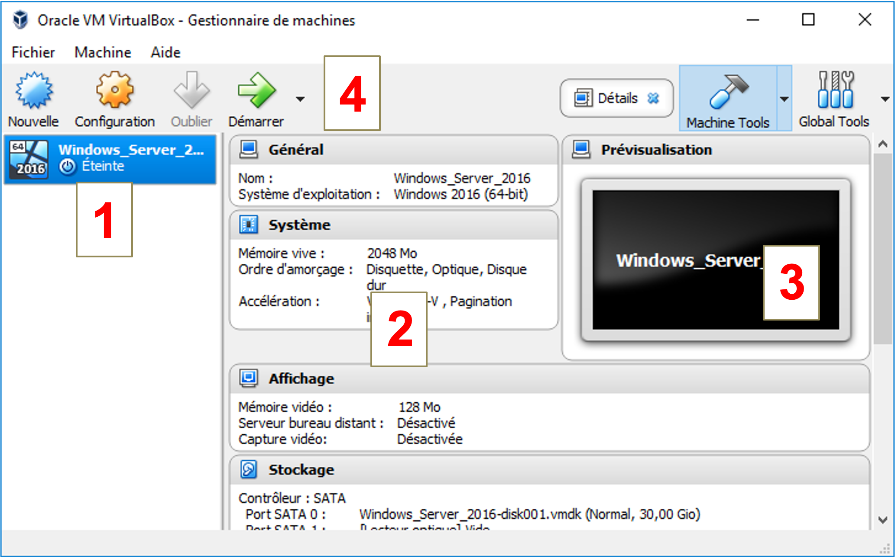
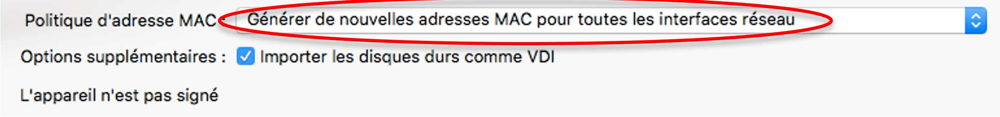
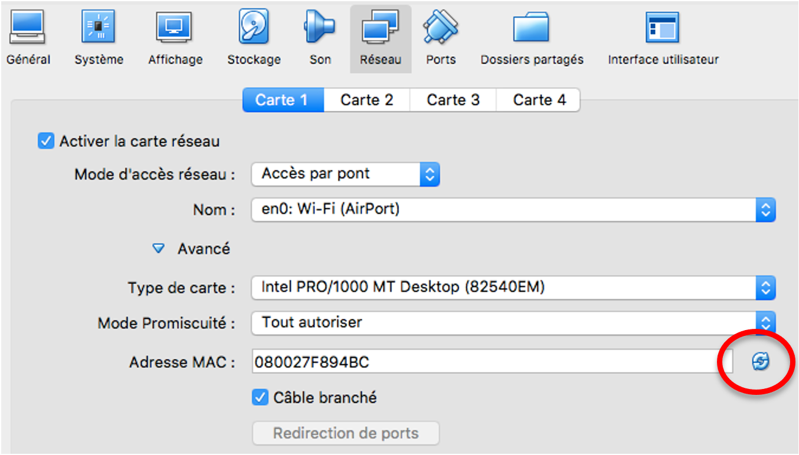
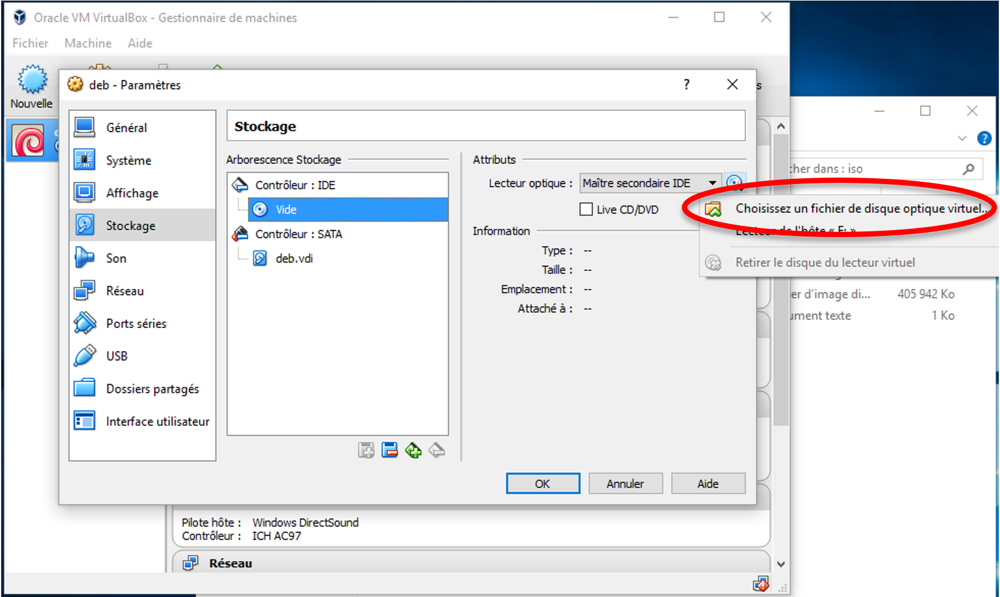
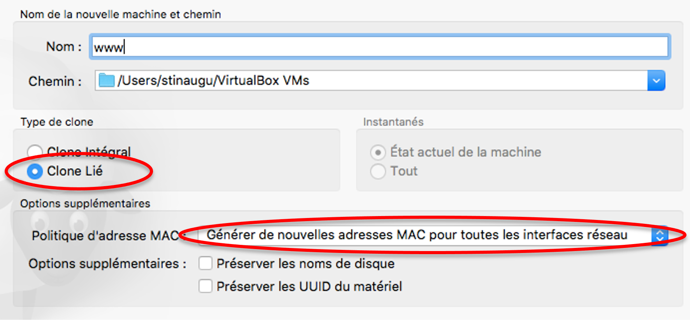
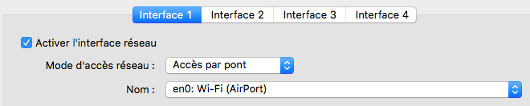
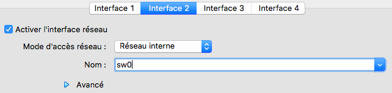
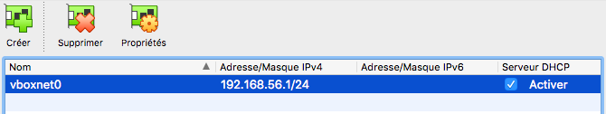

VirtualBox
==========

Interface graphique
-------------------

La GUI de `VirtualBox` se compose de quatre zones :

..
	VM distantes ! A distance : workstation, esxi, vcenter

#.	A gauche, la liste des VM actuellement gérées par l'hyperviseur
#.	A centre, les propriétés de la VM sélectionnée (CPU, RAM, disque dur, etc) 
#.	A droite, un *screenshot* de l’écran actuel de la VM
#.	En haut, les actions possibles sur la VM (démarrage, arrêt, clonage, etc)

.. _fig-vbox-gui:

	Interface de VirtualBox

Pour obtenir un affichage similaire à celui de la :numref:`fig-vbox-gui`, cliquez sur la VM, puis sur ``Machine Tools`` > ``Details``. 

Importer une VM
---------------

``Fichier`` > ``Importer un appareil virtuel`` > Sélectionner le fichier OVA à importer > ``Continuer``
Dans ``Politique d'adresse MAC``, sélectionner ``Générer de nouvelles adresses MAC pour toutes les interfaces réseau`` > ``Importer``

.. _fig-vbox-mac:

	Réinitialisation de l'adresse MAC avant importation d'une VM

.. warning:: Vous devez systématiquement réinitialiser l'adresse MAC des cartes réseau d'une VM lors de l'importation. Dans le cas contraire, vous rencontrerez des problèmes de conflit d'adresses, et la communication entre VM ne pourra pas fonctionner !

Si vous avez oublié de le faire pendant l'importation, vous pouvez toujours :ref:`changer son adresse MAC<vbox-change-mac>` à n'importe quel moment. 

.. _vbox-change-mac:

Changer l'adresse MAC d'une VM
------------------------------

Pour changer l'adresse MAC d'une VM, il faut *obligatoirement* l'arrêter. 

Sélectionner la VM dans la fenêtre principale et cliquer sur ``Configuration`` pour afficher ses propriétés.
Dans la fenêtre des paramètres, sélectionner ``Réseau`` > ``Carte 1`` > ``Avancé`` > Cliquer sur le bouton de réinitialisation à droite de l'adresse MAC et valider. 

.. _fig-vbox-change-mac:

	Changement de l'adresse MAC

Créer une VM
------------

Cliquer sur ``Nouvelle`` et suivre l'assistant de création. 
Si nécessaire, modifier les valeurs proposées (quantité de RAM, taille du disque, etc.), sinon laisser les valeurs par défaut. 

Insérer une image ISO dans le lecteur de CD (virtuel) d'une VM
--------------------------------------------------------------

Dans les caractéristiques de la VM, sélectionner ``Stockage`` > ``Contrôleur IDE``. 
Cliquer sur l'icône représentant un CD, puis sur ``Choisissez un fichier de disque optique virtuel``. 
Dans la fenêtre qui s'affiche, indiquer le fichier ISO. 

.. _fig-vbox-iso:

	Choix d'un CD d'installation

Host Key
--------

La ``Host key`` est toujours indiquée en bas à droite de la fenêtre de l'hyperviseur. Pour ``VirtualBox``, il s’agit de la touche ``Ctrl`` située à droite du clavier.

.. _fig-vbox-hostkey:

	Host key utilisée dans VirtualBox

Cloner une VM
-------------

Arrêter la VM. 

Clic-droit sur la VM à cloner >  ``Cloner``

Choisir un nom pour le clone, sélectionner ``Clone Lié`` et ``Générer de nouvelles adresses MAC ...``

.. _fig-clonage-vm:

	Clonage d'une VM

.. _mode-acces-pont:

Configurer la carte réseau d'une VM en mode ``Accès par pont``
--------------------------------------------------------------

Sélectionner la VM dans la fenêtre principale et cliquer sur ``Configuration`` pour afficher ses propriétés.

..
	Une seule carte proposée (workstation apparait pas !)

Dans la fenêtre des paramètres, sélectionner ``Réseau`` > ``Interface 1`` > ``Accès par pont``, puis choisir la carte réseau physique à laquelle elle doit être reliée.

..
	TODO : screen salle 110 PC de gauche

.. _fig-mode-bridge:

	Carte réseau en mode Accès par pont

..
	FAUX !
	La VM doit être arrêtée pour réaliser cette opération. 

.. _mode-resint:

Configurer une carte en mode ``Réseau interne`` sur le vSwitch ``sw0``
----------------------------------------------------------------------

Ouvrir la fenêtre de configuration de la VM, onglet ``Réseau``. 

Configurer la carte en mode ``Réseau interne``, puis choisir un nom pour le switch virtuel sur lequel la carte réseau sera branchée. Dans cet exemple, le switch s'appelle ``sw0``. Ce nom identifie de manière unique le switch virtuel sur l'hôte. 

.. _fig-mode-bridge:

	Carte réseau en mode Réseau interne

..
	FAUX !
	La VM doit être arrêtée pour réaliser cette opération. 

Configurer une carte en mode ``Réseau privé hôte``
--------------------------------------------------

Ouvrir la fenêtre de configuration de la VM, onglet ``Réseau``. 

Configurer la carte en mode ``Réseau privé hôte``, puis choisir le réseau virtuel ``Host-only`` approprié (s'il n'existe pas, il faut déjà le :ref:`créer<creer-host-only>`). 

..
	FAUX !
	La VM doit être arrêtée pour réaliser cette opération.

.. _creer-host-only:

Créer un réseau virtuel ``Host-only``
-------------------------------------

``Fichier`` > ``Gestionnaire de réseau hôte``

Si aucun réseau virtuel n'apparait dans la liste, cliquer sur ``Créer``.

.. _fig-vboxnet0:

	Création d'un réseau privé hôte

Ajouter une carte réseau
------------------------

Ouvrir la fenêtre de configuration de la VM, onglet ``Réseau``. 

Cliquer sur ``Interface 2``, cocher ``Activer la carte réseau``.

Il faut ensuite choisir son mode : :ref:`Accès par pont<mode-acces-pont>`, :ref:`Réseau interne<mode-resint>`, etc.

.. warning:: La VM doit être éteinte pour réaliser cette opération. 

Exporter une VM
---------------

``Fichier`` > ``Exporter un appareil virtuel``

Utiliser la touche ``Shift`` pour sélectionner les VM à exporter.

Donner un nom au fichier d'export (extension ``.ova``) et lancer l'exportation. 
