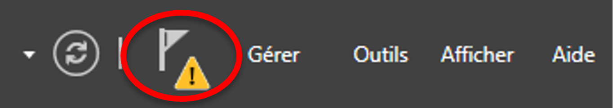

Windows Server
==============

Basé sur ``Windows Server 2016``

.. _gestionnaire-serveur:

Ouvrir le ``Gestionnaire de serveur``
-------------------------------------

``Démarrer`` > ``Gestionnaire de serveur``

.. _fig-gestionnaire-serveur:

	Gestionnaire de serveur

.. note:: Le Gestionnaire de serveur est ouvert automatiquement au démarrage de l'ordinateur

Lister les rôles
----------------

Dans le :ref:`Gestionnaire de serveur<gestionnaire-serveur>`, cliquer sur ``Gérer`` > ``Ajouter des rôles et fonctionnalités``, cliquer trois fois sur ``Suivant``. 

.. _fig-roles:

	Liste des rôles disponibles à l'installation

Installer le rôle ``Serveur DHCP``
----------------------------------

Dans le :ref:`Gestionnaire de serveur<gestionnaire-serveur>`, cliquer sur ``(2) Ajouter des rôles et des fonctionnalités`` et suivez l'assistant :

#. Choisir une ``Installation basée sur un rôle ou une fonctionnalité``
#. Sélectionner votre serveur dans la liste (normalement seul votre serveur apparaît)
#. Dans la liste des rôles disponibles, cocher ``Serveur DHCP``
#. Ajouter (valider) les fonctionnalités requises pour le rôle ``Serveur DHCP``
#. Cliquer sur ``Suivant`` (il n’y a pas d’autre rôle à installer pour l’instant)
#. Cliquer sur ``Suivant`` (il n’y a pas d’autre fonctionnalité à installer pour l’instant)
#. Cliquer à nouveau sur ``Suivant``
#. Cocher ``Redémarrer automatiquement le serveur de destination, si nécessaire`` et autoriser les redémarrages automatiques
#. Cliquer sur ``Installer``

L’installation dure quelques minutes. On peut suivre sa progression :

.. _fig-installation-progression:

	Progression de l'installation

.. note:: Cette fenêtre de progression peut être fermée pendant l'installation. Pour suivre la progression de l’installation, dans le :ref:`Gestionnaire de serveur<gestionnaire-serveur>`, cliquer sur le bouton ``Notifications`` (le drapeau en haut à droite, voir Fig. 34) puis Détails de la tâche. 

.. _fig-drapeau-notification:

	Notifications dans le Gestionnaire de serveur

Après l’installation, terminer la configuration du rôle en cliquant sur la zone de ``Notifications`` puis sur ``Terminer la configuration DHCP``.

.. _fig-terminer-config-dhcp:

	Terminer la configuration DHCP

Valider la configuration par défaut et mener l’assistant de configuration jusqu’à son terme. 

.. _desinstall-role:

Désinstaller un rôle ou une fonctionnalité
------------------------------------------

Dans le :ref:`Gestionnaire de serveur<gestionnaire-serveur>`, cliquer sur ``(2) Ajouter des rôles et des fonctionnalités``.

Décocher la case correspondant au rôle ou à la fonctionnalité à désinstaller.

.. _gestionnaire-dhcp:

Ouvrir le ``Gestionnaire DHCP``
-------------------------------

Dans le :ref:`Gestionnaire de serveur<gestionnaire-serveur>`, cliquer sur ``Outils`` et sélectionner ``DHCP`` dans la liste. 

.. _fig-menu-outils:

	Gestionnaire de serveur, menu principal

La fenêtre du gestionnaire DHCP s’ouvre. Double-cliquer sur votre serveur dans le menu à gauche.

.. _fig-gestionnaire-dhcp:

	Gestionnaire DHCP

Créer une étendue DHCP IPv4
---------------------------

Dans le :ref:`Gestionnaire DHCP<gestionnaire-dhcp>`, clic droit sur ``IPv4`` > ``Nouvelle étendue``. 
Répondre pas-à-pas aux questions de l’assistant de l'``Assistant Nouvelle étendue``. 

Activer une étendue DHCP IPv4
-----------------------------

Dans le :ref:`Gestionnaire DHCP<gestionnaire-dhcp>`, clic droit sur l'étendue >  ``Activer``

Afficher les baux DHCP
----------------------

Dans le :ref:`Gestionnaire DHCP<gestionnaire-dhcp>`, sélectionner l'étendue > ``Baux d'adresses``.

Affiche la liste des adresses IP actuellement attribuées aux postes de travail :

.. _fig-baux:

	Baux d'adresses

Si des baux semblent manquer dans la partie droite, faire un clic droit sur ``Baux d’adresses`` > ``Actualiser``

Créer le domaine ``heisenberg.org``
-----------------------------------

Dans le :ref:`Gestionnaire de serveur<gestionnaire-serveur>`, cliquer sur le bouton des ``Notifications`` > ``Promouvoir ce serveur en contrôleur de domaine``.

..
	Nom de domaine racine
	Niveau fonctionnel de la forêt
	Serveur DNS
	Nom Netbios
	Chemins d’accès

Choisir ``Ajouter une nouvelle forêt`` et indiquer le ``Nom de domaine racine`` :

.. code-block:

	heisenberg.org

Laisser *tous les autres paramètres* par défaut, à part le ``Mot de passe du mode de restauration des services d’annuaire (DSRM)`` : indiquer ``vitrygtr``.

.. _gestionnaire-domaine:

Gérer les utilisateurs et ordinateurs du domaine
------------------------------------------------

Dans le :ref:`Gestionnaire de serveur<gestionnaire-serveur>`, cliquer sur ``Outils`` > ``Utilisateurs et ordinateurs Active Directory``

*La suite est facile à trouver !*

..
	Reformulé 'utilisateur active directory'

Créer un utilisateur du domaine
-------------------------------

L'ajout d'utilisateur se passe dans le :ref:`Gestionnaire des utilisateurs et ordinateurs du domaine<gestionnaire-domaine>`.

..
	Décocher la case L'utilisateur doit changer le mot de passe à la prochaine ouverture de session, pour éviter d'avoir à changer une nouvelle fois le mot de passe.

.. warning:: Le mot de passe ``vitrygtr`` est trop simple pour être utilisé dans le domaine. Utiliser par exemple, le mot de passe ``VitryGTR94``.

..
	Reformulé 'utilisateur Active Directory'

Déverrouiller un utilisateur du domaine
---------------------------------------

..
	http://pbarth.fr/node/240

Afficher les propriétés de l'utilisateur dans le :ref:`Gestionnaire des utilisateurs et ordinateurs du domaine<gestionnaire-domaine>`.

Déléguer une tâche à un utilisateur
-----------------------------------

Dans le :ref:`Gestionnaire des utilisateurs et ordinateurs du domaine<gestionnaire-domaine>`, clic droit sur l'OU sur laquelle on souhaite appliquer la délégation > ``Délégation de contrôle``

Indiquer l'utilisateur devant bénéficier de la délégation puis sélectionner la(les) tâche(s) à déléguer. 

..
	Exemple : Réinitialiser les mots de passe utilisateur

..
	TODO : Screenshot 2016 !

.. _fig-delegation:

	Exemple de délégation : reset de mot de passe

Afficher les délégations d'une OU
---------------------------------

Dans le :ref:`Gestionnaire des utilisateurs et ordinateurs du domaine<gestionnaire-domaine>`, ``Affichage`` > ``Fonctionnalités avancées``. 

Clic droit sur l'OU > ``Propriétés`` > ``Sécurité`` > ``Avancé``

..
	TODO : Screenshot 2016 !

.. _fig-afficher-delegations:

	Affichage des délégations

.. gestionnaire-gpo:

Ouvrir le ``Gestionnaire des stratégies de groupe`` (GPO)
---------------------------------------------------------

Dans le :ref:`Gestionnaire de serveur<gestionnaire-serveur>`, cliquer sur  ``Outils`` > ``Gestion des stratégies de groupe``

.. _fig-gestion-gpo-bluesky:

	Gestionnaire des stratégies de groupe

Passer en mode ``Core`` ou ``MinShell``
---------------------------------------

Pour passer en mode ``Core``, :ref:`désinstaller la fonctionnalité<desinstall-role>` ``Interfaces utilisateur et infrastructure``. 

Pour passer en mode ``MinShell``, :ref:`désinstaller le rôle<desinstall-role>` ``Shell graphique du serveur``.

.. _fig-desinstall-shellgraphique:

	Activation des modes Core ou MinShell

Créer une GPO dans l'OU ``Ordinateurs``
---------------------------------------

..
	Dans le menu à gauche, développez l’item Forêt > Domaines > Votre domaine (normalement, il s’agit d’ad2012.local). Vous verrez apparaitre toutes les OU créées précédemment.

Dans le :ref:`Gestionnaire des stratégies de groupe<gestionnaire-gpo>`, clic-droit sur l’OU ``Ordinateurs`` > ``Créer un objet GPO dans ce domaine, et le lier ici ...``

Dans la fenêtre qui apparaît, nommer la GPO (par exemple : ``Afficher extensions fichiers``) et valider. 

La nouvelle GPO apparaît dans l'OU ``Ordinateurs``. 

.. emplacement-gpo:

Identifier l'emplacement d'un paramètre GPO
-------------------------------------------

Dans le :ref:`Gestionnaire des stratégies de groupe<gestionnaire-gpo>`, clic-droit sur la GPO > ``Modifier``

La fenêtre qui apparaît contient l’ensemble des paramètres configurables par une GPO. *Il en existe des milliers !*

..
	il est possible d’en rajouter en créant ses propres GPO pour contrôler les paramètres qui n’ont pas été envisagés dans l’éditeur

Ces paramètres sont organisés en deux grandes catégories (:numref:`fig-parametres-gpo`) : 

- ``Configuration ordinateur`` contient les paramètres configurables pour un ordinateur. *Ces paramètres seront appliqués au moment du démarrage du poste de travail.*
- ``Configuration utilisateur`` contient les paramètres configurables pour un utilisateur. *Ces paramètres seront appliqués au moment où l’utilisateur ouvre une session.*

.. _fig-parametres-gpo:

	Éditeur des stratégies de groupe

Une fois le paramètre identifié et localisé, il suffit de modifier ses propriétés et valider. 

Autoriser le ping via une GPO
-----------------------------

:ref:`Identifier l'emplacement du paramètre<emplacement-gpo>` suivant :

	``Configuration d’ordinateur`` > ``Stratégies`` > ``Modèles d'administration : ...`` > ``Réseau`` > ``Connexions réseau`` > ``Pare-feu Windows`` > ``Profil du domaine`` > ``Pare-feu Windows : autoriser les exception ICMP``

Dans la fenêtre qui s'affiche, sélectionner ``Activé``, puis cocher ``Autoriser les requêtes d'écho entrantes``.

.. _fig-gpo-ping:

	Paramétrage du protocole ICMP dans le pare-feu

Déléguer la modification d'une GPO au groupe ``Admin_helpdesk_ad``
------------------------------------------------------------------

Sélectionner la GPO > Onglet ``Délégation`` > ``Ajouter`` > ``Sélectionner le groupe Admin_helpdesk_ad`` > Choisir ``Modifier les paramètres``

.. _fig-delegation-gpo:

	Délégation d'une GPO

Ouvrir le gestionnaire des utilisateurs et groupes locaux
---------------------------------------------------------

``Windows + R`` > ``lusrmgr.msc``

.. _fig-lusrmgr:

.. figure:: images/lusrmgr.png

	Gestion du groupe local ``Administrateurs``

Afficher la liste des administrateurs locaux d'un poste
-------------------------------------------------------

.. code-block::

	net localgroup Administrateurs

Dans cet exemple, les ``Administrateurs locaux`` sont :
- Les utilisateurs locaux ``Administrateur`` et ``etudiant``
- Les utilisateurs Active Directory ``adm_h_BAU`` et ``pinkman``
- Le groupe Active Directory ``Admins du domaine``

.. _fig-netlocalgroupopenspace:

	Liste des administrateurs locaux

Ajouter un utilisateur à un groupe
----------------------------------

Ouvrir le :ref:`Gestionnaire des utilisateurs et ordinateurs du domaine<gestionnaire-domaine>`. 

Clic droit sur le groupe > ``Propriétés`` > ``Membres`` > Ajouter l'utilisateur

Désactiver un utilisateur
-------------------------

Ouvrir le :ref:`Gestionnaire des utilisateurs et ordinateurs du domaine<gestionnaire-domaine>`. 

Clic droit sur l'utilisateur > ``Désactiver``

Créer un groupe de sécurité dans l'OU ``Laverie``
-------------------------------------------------

Ouvrir le :ref:`Gestionnaire des utilisateurs et ordinateurs du domaine<gestionnaire-domaine>`. 

Clic droit sur l'OU ``Laverie`` > ``Ajouter`` > ``Groupe``

Indiquer le nom du groupe et laisser les autres paramètres par défaut. 

