Windows
=======

Lancer un ping vers l'adresse IP ``8.8.8.8``
--------------------------------------------

:ref:`terminal`, puis :

.. code-block::

	ping 8.8.8.8

Cette commande envoie quatre requêtes puis s'arrête. 

Un ping réussi affiche les lignes suivantes :

.. _fig-ping-windows:

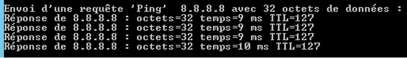

	Ping réussi

Ces messages prouvent que le destinataire répond bien aux requêtes envoyées par PC.

Tout autre message (ou une absence de message) indique un échec. 

.. _terminal:

Ouvrir un terminal
------------------

Dans la ``Barre des tâches``, ``Cortana`` permet de faire une recherche des applications et fonctionnalités disponibles :

.. _fig-cortana:

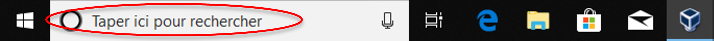

	Cortana

Pour rechercher l'application ``Terminal``, taper :

.. code-block::

	Invite de commande

.. _centre-reseau:

Afficher le ``Centre Réseau et partage``
----------------------------------------

Clic droit sur le bouton ``Démarrer`` > ``Connexions réseau`` > ``Centre Réseau et partage``.

.. _connexions-reseau:

Afficher les cartes réseau
--------------------------

Clic droit sur le bouton ``Démarrer`` > ``Connexions réseau`` > ``Centre Réseau et partage`` > ``Modifier les paramètres de la carte``

Une fenêtre similaire à la suivante s’affiche :

.. _fig-connexions-reseau:

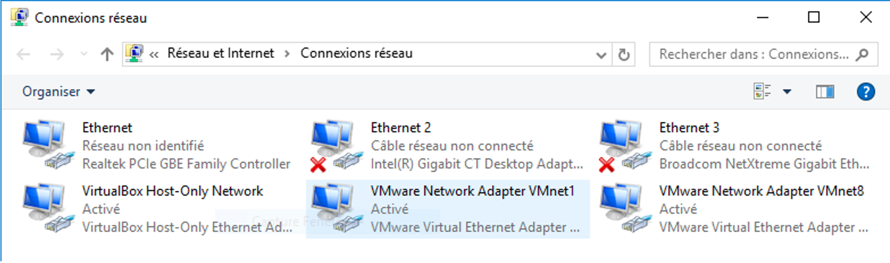

	Connexions réseau

Les cartes Ethernet sont nommées ``Ethernet ... ``. Les autres cartes qui apparaissent sont des cartes virtuelles liées aux hyperviseurs installés sur les PC (``VirtualBox`` et ``VMware``). *Ignorez-les pour le moment.*

Pour afficher cette fenêtre, vous pouvez également cliquer sur l’icône correspondant aux connexions réseau (icône représentant un ordinateur) dans la *systray* (zone de notification en bas à droite, sur la barre des tâches) :

.. _fig-systray:

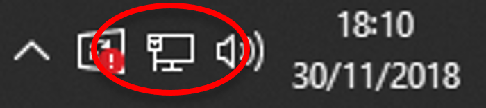

	Systray

Redémarrer le système
---------------------

L'option d'arrêt est disponible dans le menu ``Démarrer``. 

..
	TODO : placer dans VirtualBox, et :ref:

si vous êtes dans une VM et que ``Windows`` reste bloqué pendant l'arrêt des services, forcez le redémarrage en cliquant sur ``Machine`` > ``Redémarrer`` dans le menu principal de ``VirtualBox``. 

Faire une capture d'écran
-------------------------

..
	Snipping-tool

Dans ``Cortana``, taper ``capture`` puis cliquer sur ``Outil Capture d'écran``.

.. _afficher-ip

Déterminer l'adresse IP de la carte réseau ``Ethernet 4``
---------------------------------------------------------

Dans la fenêtre des :ref:`Connexions Réseau<connexions-reseau>` (:numref:`fig-connexions-reseau`), double-clic sur le nom de la carte ``Ethernet 4``. 
La fenêtre d’``Etat de la connexion`` s’affiche. Cliquez sur ``Détails`` pour afficher sa configuration complète. 

.. _fig-details-connexion-reseau:

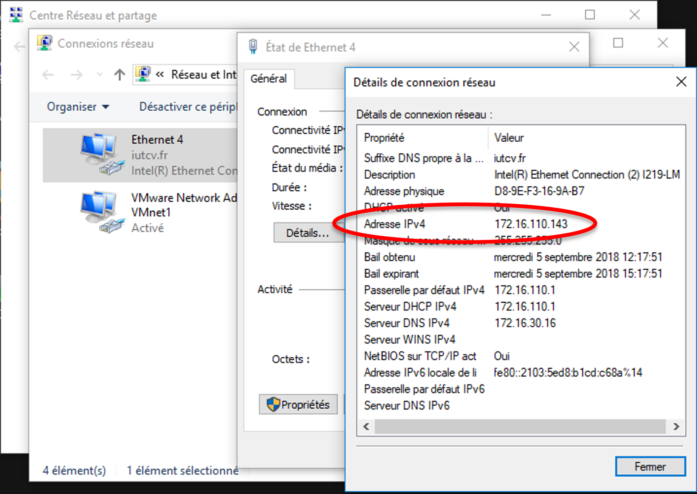

	Affichage de l'adresse IP

Afficher l'adresse de la passerelle par défaut
----------------------------------------------

..
	TODO : mémo affiche détails connexion + mémo afficher adresse IP + mémo afficher passerelle

Afficher les détails de la connexion réseau (:numref:`fig-details-connexion-reseau`). 
Dans cet exemple, l'adresse de la passerelle par défaut est ``172.16.110.1``. 

Afficher l'adresse du serveur DNS
---------------------------------

..
	TODO : voir ci-dessus

Afficher les détails de la connexion réseau (:numref:`fig-details-connexion-reseau`). 
Dans cet exemple, l'adresse du serveur DNS est 172.16.30.16. 

Résoudre le nom de domaine ``www.perdu.com``
--------------------------------------------

.. code-block::

	nslookup www.perdu.com

Affiche :

.. code-block::
	:emphasize-lines: 6

	Serveur :   UnKnown
	Address:  172.16.30.16

	Réponse ne faisant pas autorité :
	Nom : www.perdu.com
	Address: 208.97.177.124

L'adresse IP de ``www.perdu.com`` est donc ``208.97.177.124``.

.. _conf-carte-ethernet:

Afficher la configuration de la carte ``Ethernet``
--------------------------------------------------

Dans la fenêtre des :ref:`Connexions Réseau<connexions-reseau>` (:numref:`fig-connexions-reseau`), double-cliquer sur la carte ``Ethernet``, puis cliquer sur le bouton ``Propriétés``. La fenêtre des propriétés de la connexion s’affiche, similaire à la :numref:`fig-proprietes-connexion-reseau` (milieu). 

Double-cliquer sur ``Protocole Internet version 4 (TCP/IPv4)``. 
La fenêtre ``Propriétés de : Protocole Internet version 4 (TCP/IPv4)`` s’affiche (:numref:`fig-proprietes-connexion-reseau`, à droite). 

.. _fig-proprietes-connexion-reseau:

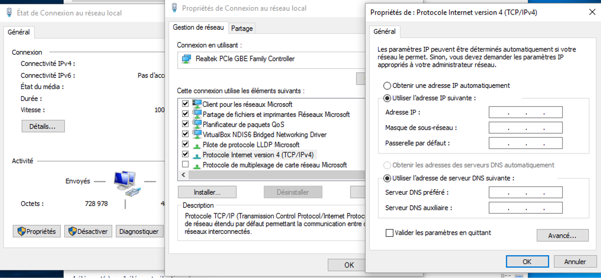

	Propriétés de la connexion réseau et TCP/IP

Effacer la configuration IP
---------------------------

Dans un terminal :

.. code-block::

	ipconfig /release

Permet de libérer le bail DHCP, donc *oublier* les paramètres IP configurés en DHCP (adresse IP, passerelle, serveur DNS). 

.. _conf-dynamique

Configurer la carte ``Ethernet 4`` en adressage dynamique persistant
--------------------------------------------------------------------

:ref:`Afficher la configuration<conf-carte-ethernet>` de la carte ``Ethernet 4``. 
Sélectionner ``Obtenir une adresse IP automatiquement`` et cliquer sur ``OK`` pour valider la configuration. 
Fermer la fenêtre des propriétés de la connexion.

..
	IMPORTANT 2020 : Dans certains cas, il peut être nécessaire de désactiver puis réactiver la connexion réseau pour que les modifications soient prises en compte. 

:ref:`Afficher la configuration IP<afficher-ip>` de la carte réseau et bien vérifier qu'elle a obtenu une adresse dans le réseau ``172.16.110.0/24``. 

.. warning:: Si aucune adresse IP n’apparaît, ou que la carte a obtenu une adresse IP dans le réseau ``169.254.0.0/16``, c'est qu'il y a un problème quelque part. 

Configurer la carte ``Ethernet 4`` en adressage statique
--------------------------------------------------------

Suivre la même méthode que pour :ref:`configurer une carte en adressage dynamique<conf-dynamique>`, mais dans la fenêtre ``Propriétés de : Protocole Internet version 4 (TCP/IPv4)``, sélectionner :

- ``Utiliser l’adresse IP suivante :`` et indiquer l'adresse IP et le masque
- *Si nécessaire*, indiquer la passerelle
- ``Utiliser l'adresse de serveur DNS suivante :`` *si nécessaire*, indiquer l'adresse IP du serveur DNS

Activer/Désactiver la carte ``Ethernet 4``
------------------------------------------

Dans la fenêtre des :ref:`Connexions Réseau<connexions-reseau>` (:numref:`fig-connexions-reseau`), clic droit sur la carte ``Ethernet 4`` > ``Activer`` ou ``Désactiver``.

Déterminer sur quelle carte le câble Ethernet est branché
---------------------------------------------------------

Dans la fenêtre des :ref:`Connexions Réseau<connexions-reseau>` (:numref:`fig-connexions-reseau`), observer l'icône de chaque carte Ethernet.
Dans l'exemple suivant, seule la carte ``Ethernet`` est reliée à un équipement actif. Les cartes ``Ethernet 2`` et ``Ethernet 3`` ne le sont pas.

.. _cable-ou-pas:

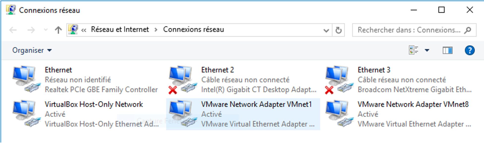

	``Ethernet 2`` et ``3`` ne sont pas câblées

Renommer une carte réseau
-------------------------

Dans la fenêtre des :ref:`Connexions Réseau<connexions-reseau>` (:numref:`fig-connexions-reseau`), clic droit sur la carte > ``Renommer``

Partager la connexion de la carte ``Ethernet 4``
------------------------------------------------

Dans la fenêtre des :ref:`Connexions Réseau<connexions-reseau>` (:numref:`fig-connexions-reseau`), clic droit sur la carte ``Ethernet 4`` > ``Propriétés`` > ``Partage``
Choisir la connexion qui bénéficie du partage puis valider. 

..
	2020 : cocher "autoriser d'autres utilisateurs à partager …" sinon ça valide pas (??? Un cas en 2020)

.. warning:: L'assistant vous propose d'attribuer une adresse dans le réseau ``192.168.37.0/24``, sur la carte qui bénéficie du partage. *Sur le moment, il faut accepter cette configuration (pas le choix !)* MAIS rien ne vous empêche de la modifier juste après.

..
	Inutile à présent

Désactiver le pare-feu
----------------------

Dans ``Cortana``, taper ``Pare-feu Windows Defender``.
Dans la fenêtre de configuration du pare-feu, cliquer sur ``Activer ou désactiver le Pare-feu`` puis ``Désactiver`` pour les réseaux privés et publics

..
	Inutile à présent

Autoriser les requêtes de ping dans le pare-feu Windows
-------------------------------------------------------

Dans le :ref:`Centre Réseau et partage<centre-reseau>`, cliquer sur Pare-feu Windows (en bas à gauche).

Dans la fenêtre qui s'affiche, cliquer sur ``Paramètres avancés`` > ``Règles de trafic entrant``

Cette fenêtre liste l’ensemble des règles de filtrage du trafic *entrant* sur le PC (c’est à dire, le trafic reçu par le PC, par opposition au trafic *sortant*, émis par le PC). 
Dans la liste, trouver la règle suivante et l'activer :

.. code-block::
	
	Partage de fichiers et d’imprimantes (Demande d’écho – Trafic entrant ICMPv4). 

.. warning:: Attention, il y a deux lignes à activer !

Afficher l'aide de la commande ``nslookup``
-------------------------------------------

.. code-block::

	nslookup /?

Raccourcis clavier de gestion des objets (texte et fichiers)
------------------------------------------------------------

.. csv-table:: Raccourcis clavier
   :header: "Fonction", "Déclencheur", "Rôle"
   :widths: 100, 60, 250

   "Copier", ``Ctrl + C``, "Copier le texte (ou les fichiers) sélectionné dans le presse-papier"
   "Couper", ``Ctrl + X``, "Couper le texte (ou les fichiers) sélectionné"
   "Coller", ``Ctrl + V``, "Coller le texte (ou les fichiers) présent(s) dans le presse-papier"
   "Sélectionner tout", ``Ctrl + A``, "Sélectionner tout le texte / tous les fichiers"
   "Supprimer", ``Shift + Suppr``, "Sur un fichier (ou dossier) sélectionné, permet de supprimer ce fichier (ou dossier) définitivement, sans qu’il soit placé dans la Corbeille (*à utiliser à bon escient !*)."

Raccourcis clavier de gestion des fenêtres
------------------------------------------

.. csv-table:: Raccourcis clavier
   :header: "Fonction", "Déclencheur", "Rôle"
   :widths: 100, 60, 250

   "Démarrer", ``Windows + X``, "Équivaut à un clic *droit* sur le bouton Démarrer"
   "Verrouiller", ``Windows + L``, "Verrouiller la session en cours"
   "Exécuter", ``Windows + R``, "Ouvrir la fenêtre Exécuter"
   "Explorer", ``Windows + E``, "Ouvrir l’explorateur Windows"
   "Afficher/Masquer", ``Windows + D``, "S’applique sur le bureau avec plusieurs fenêtres ouvertes pour ..."
   "Agrandir/Réduire", ``Windows + Fleche haut ou bas``, "S’applique sur une fenêtre pour ..."
   "", ``Windows + Fleche gauche ou droite``, "S’applique sur une fenêtre pour ..."
   "Naviguer", ``Alt + Tab``, "Naviguer entre les fenêtres ouvertes sur le bureau"
   "Naviguer", ``Windows + Tab``, "*Idem*"
   "", ``Tab``, "Passer d’une zone de texte à une autre dans la fenêtre active"

Créer un raccourci personnel pour lancer ``Firefox``
----------------------------------------------------

Clic droit sur l’icône de ``Firefox`` (sur le Bureau ou dans l’``Explorateur Windows``) > ``Propriétés``. 

Dans l’onglet ``Raccourci``, cliquer dans la zone de texte ``Touche de Raccourci`` et presser la combinaison de touches ``Ctrl + Alt + 0``.

Cette combinaison de touches déclenche maintenant l'ouverture du navigateur Web. 

Liste complète des raccourcis Windows
-------------------------------------

`Site de Microsoft <https://support.microsoft.com/fr-fr/help/12445/windows-keyboard-shortcuts>`_

.. _infos-syst:

Afficher les Informations système générales
-------------------------------------------

Dans le ``Panneau de configuration``, cliquer sur ``Système et sécurité`` > ``Système``

Renommer un PC
--------------

Dans la fenêtre des :ref:`Informations système générales<infos-syst>`, cliquer sur le lien ``Modifier les paramètres``, situé à côté du nom de l’ordinateur (:numref:`fig-infos-syst`). 

.. _fig-infos-syst:

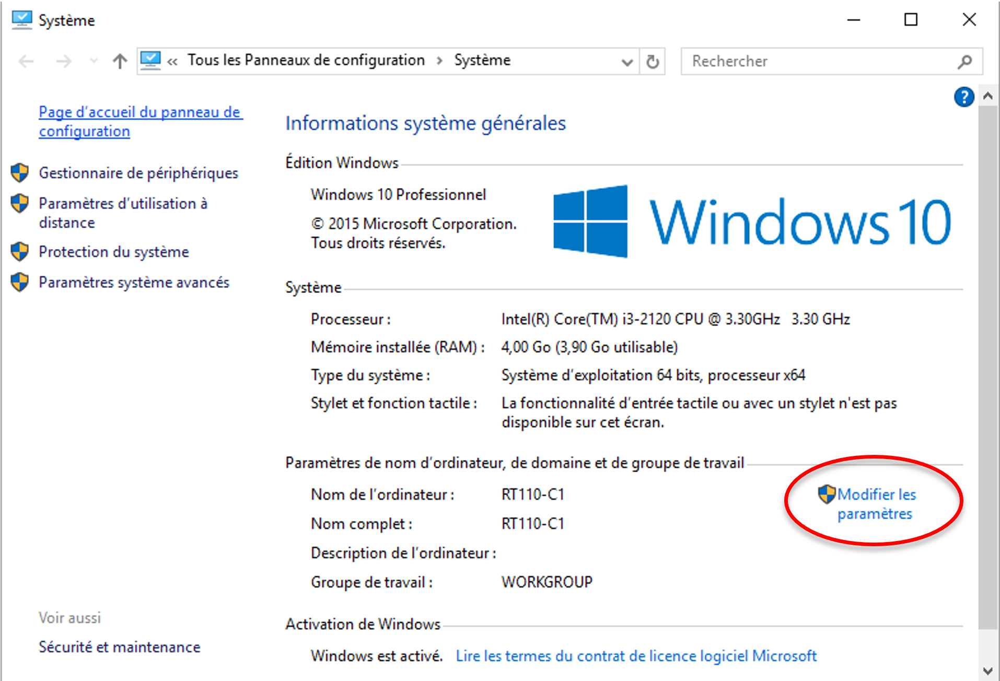

	Informations système générales

La fenêtre des propriétés système s’affiche (:numref:`fig-prop-systeme`, fenêtre de gauche). Cliquer sur le bouton ``Modifier``, indiquer le nouveau nom et valider. 

.. _fig-prop-systeme:

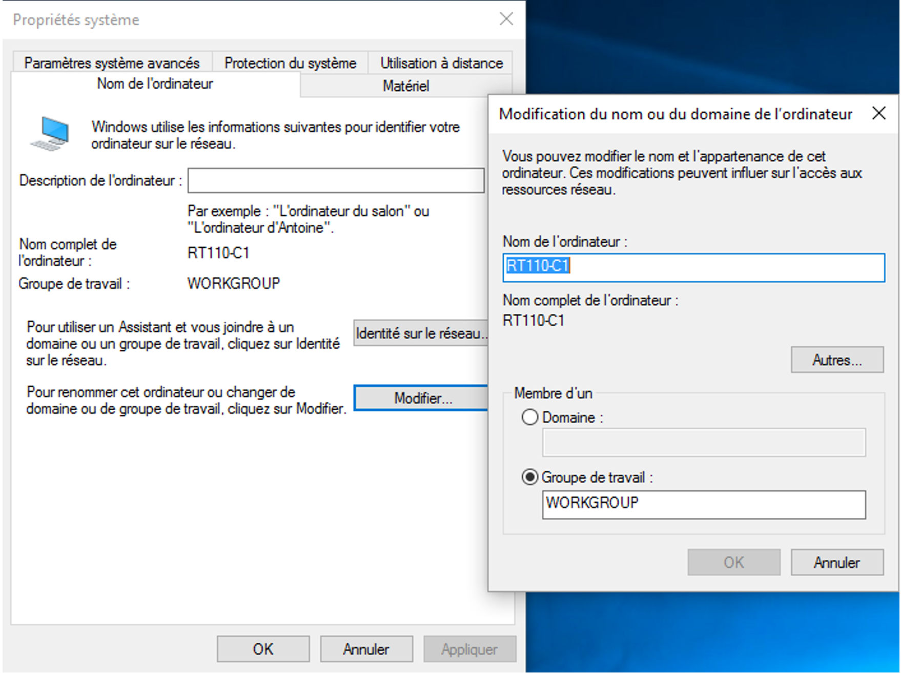

	Propriétés système et modification du nom ou du groupe de travail/domaine

Redémarrer l’ordinateur (*oui Robert, c'est indispensable et vous devez le faire maintenant*). 

Se connecter en SSH sur le PC ``203.0.113.10`` avec le compte ``otabenga``
--------------------------------------------------------------------------

Utiliser l'application ``PuTTY``. La suite est facile à trouver !

Sinon, :ref:`ouvrir un terminal<terminal>` et utiliser la :ref:`commande Linux<connexion-ssh-linux>`.

.. _connexion-ftp:

Se connecter en FTP sur le PC ``203.0.113.10`` avec le compte ``otabenga``
--------------------------------------------------------------------------

Solution 1
""""""""""

Dans un navigateur Web, taper l'URL :

.. code-block::

	ftp://otabenga@203.0.113.10

Solution 2
""""""""""

Utiliser l'application ``FileZilla``. Renseigner les champs ``Hôte``, ``Identifiant`` et ``Mot de passe``. 

Si la connexion est acceptée, ``FileZilla`` affiche ``Connecté`` dans les messages de statut et les fichiers du serveur FTP apparaissent dans le cadre de droite. 

.. _fig-filezilla:

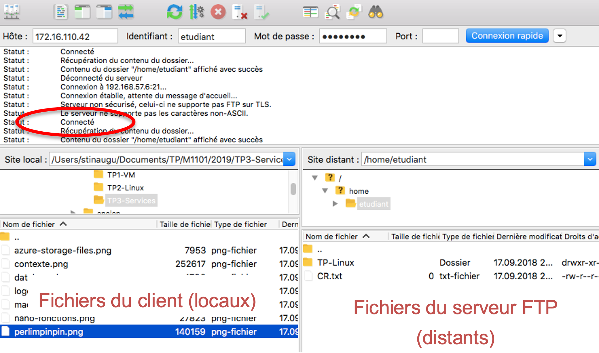

	Transfert FTP en GUI

Solution 3
""""""""""

.. code-block::

	ftp 203.0.113.42

*La suite est facile à trouver*. Pour lister le répertoire courant, utiliser ``ls``.

Partager le dossier ``C:\films`` présent sur PC2
------------------------------------------------

Dans l'Explorateur Windows de PC2, clic droit sur le dossier ``films`` > ``Propriétés`` > Onglet ``Partage`` > ``Partager ...``
La fenêtre de ``Partage de fichier`` s’affiche. 
Cliquer sur ``Partager``. 

Veillez également à régler les droits d'accès sur le dossier (onglet ``Sécurité``). 

..
	Effet : autoriser pings dans firewall pour profil privé

Si le message suivant s'affiche, cliquer sur ``Non, changer le réseau auquel je suis connecté en réseau privé``. 

.. _fig-decouverte-reseau:

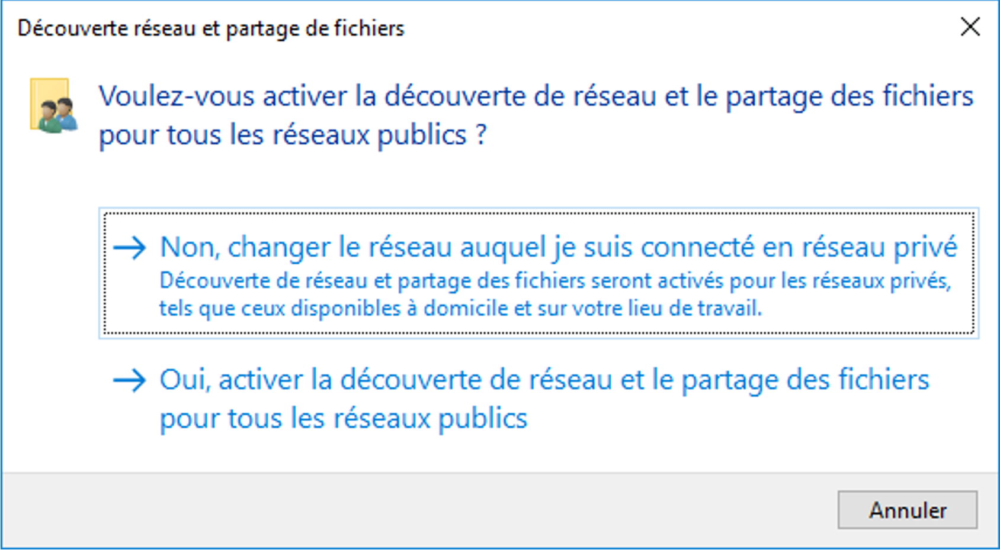

	Découverte réseau et partage de fichiers

.. _changer-profil:

Changer le profil réseau de la connexion
----------------------------------------

..
	Parfois pas possible dans l'interface Métro. 
	Dans ce cas, donner commande PowerShell
	(Set-NetConnectionProfile)

Le profil réseau agit sur le firewall de Windows 10. Pour simplifier :

- Le profil ``public`` bloque toute communication à destination de l'ordinateur. Il est adapté pour les réseaux non fiables, comme les hot-spots WiFi 
- Le profil ``privé`` est plus permissif. Il est adapté pour les réseaux de confiance, à domicile ou au travail

Clic droit sur le bouton ``Démarrer`` > ``Connexions réseau`` > ``Modifier les propriétés de connexion`` puis sélectionner le profil voulu :

.. _fig-profil-reseau:

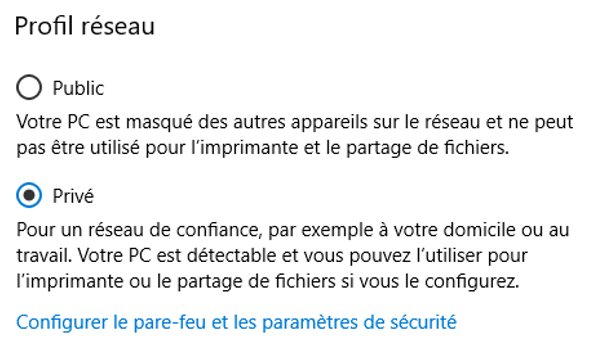

	Changement du profil réseau

Dans le :ref:`Centre réseau et partage<centre-reseau>`, le profil réseau est affiché à côté du nom de la connexion réseau :

.. _fig-affiche-profil-reseau:

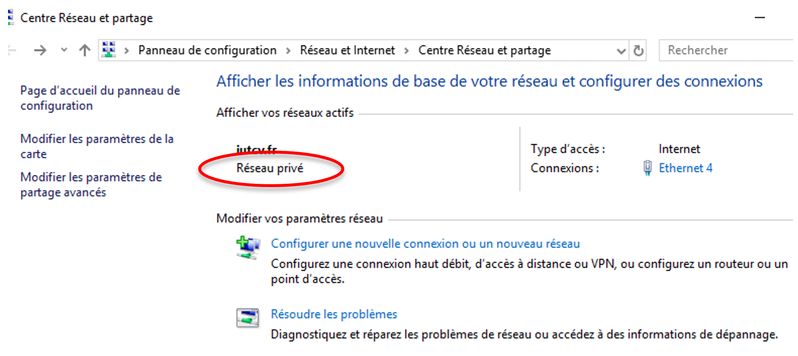

	Affichage du profil réseau

Autoriser le partage de fichiers
--------------------------------

Il faut d'abord :ref:`changer le profil réseau<changer-profil>` en ``Réseau privé``. *Même si cela est possible, il est déconseillé d'activer le partage de fichiers pour le profil ``Réseau public``, pour des raisons de sécurité.*

Dans le :ref:`Centre Réseau et partage<centre-reseau>`, cliquer sur ``Modifier les paramètres de partage avancés``. 

Cliquer sur ``Activer le partage de fichiers et d'imprimante`` pour le profil réseau actuel (``Privé``). 

.. _fig-activation-partage:

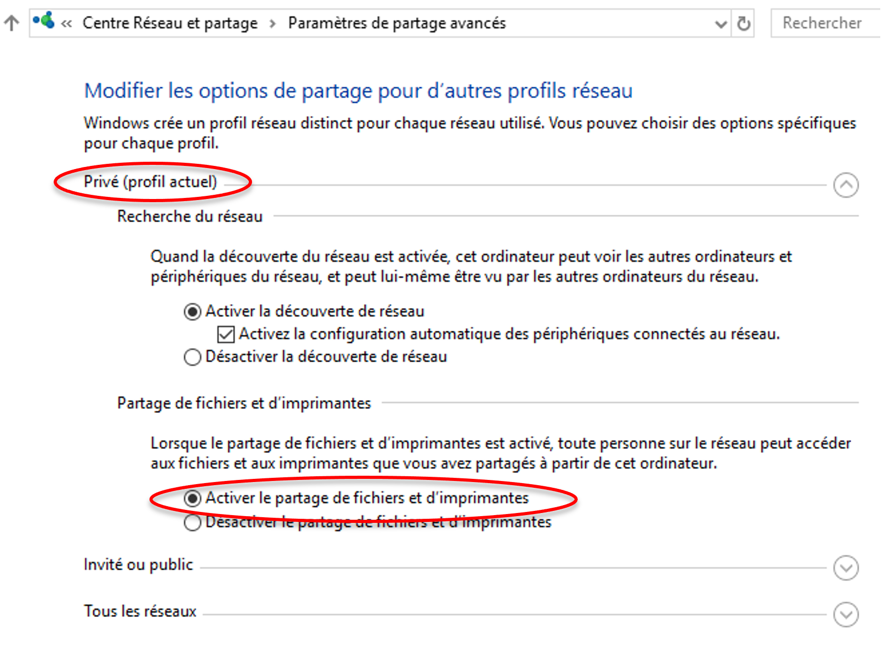

	Activation du partage de fichiers

Afficher un dossier partagé
---------------------------

On suppose que le dossier partagé se nomme ``partage`` et se trouve sur ``MARGUERITE-3`` (adresse IP : ``172.16.110.42``). On souhaite afficher son contenu à partir de ``COQUELICOT-3``. 

Dans l'``Explorateur Windows`` de ``COQUELICOT-3``, taper :

.. code-block::

	\\172.16.110.42\partage

.. _fig-unc-partage:

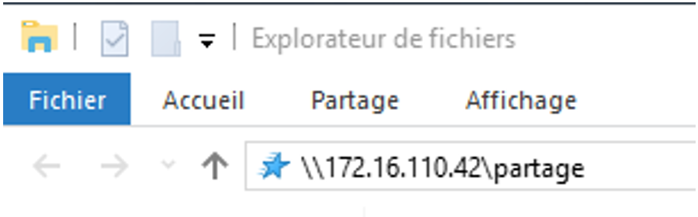

	Accès au dossier partagé avec son chemin UNC

Il s'agit du chemin UNC du dossier (*Universal Naming Convention*).

..
	Remarque : l'UNC fonctionne aussi avec le nom, désactiver ipv6 sinon résolution du nom donne une ipv6, or (?) flux ipv6 pas autorisé quand on coche "Activer le partage de fichiers et d'imprimantes"

Entrer ensuite les identifiants de connexion :

.. _fig-identifiants-partage:

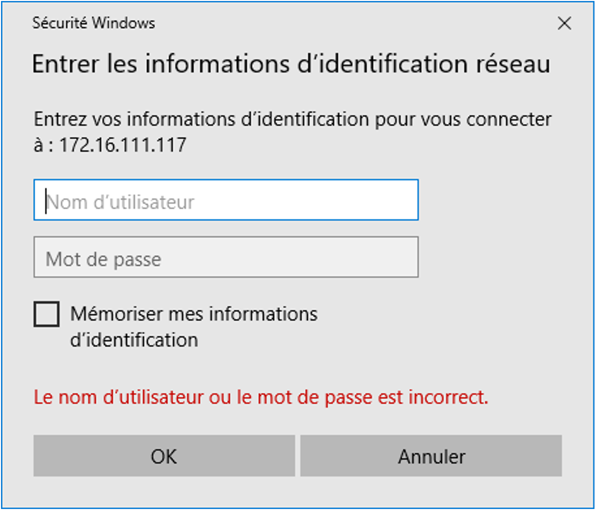

	Identifiants de connexion à un dossier partagé

Inspecter les droits d'un dossier partagé
-----------------------------------------

..
	Partage avancé > Autorisations
	Marche pas ??? affiche pas les mêmes autorisations

Dans l\'``Explorateur Windows``, clic droit sur le dossier > ``Propriétés`` > Onglet ``Partage`` > ``Partager``

Cette fenêtre affiche la liste des utilisateurs autorisés et leurs droits d'accès (*lecture, écriture*). 

Configurer les autorisations d'accès à un dossier partagé
---------------------------------------------------------

Dans l\'``Explorateur Windows``, clic droit sur le dossier > ``Propriétés`` > Onglet ``Partage`` > ``Partager``

..
	Partage avancé > Autorisations
	Marche pas ??? affiche pas les mêmes autorisations

Cette fenêtre permet de :

- Autoriser un utilisateur
- Modifier les droits d'un utilisateur 
- Retirer les droits à un utilisateur

Créer un utilisateur
--------------------

Clic-droit sur le bouton Démarrer > ``Gestion de l’ordinateur`` > ``Utilisateurs et groupes locaux`` > ``Utilisateurs`` > Clic-droit ``Nouvel utilisateur ...`` > Remplir la fiche du nouvel utilisateur

Les seuls champs obligatoires sont le ``Nom`` et le mot de passe.

..
	Important sinon login sur dossier partagé marche pas

Décocher la case ``L'utilisateur doit changer le mot de passe à la prochaine ouverture de session``.

Fermer la session
-----------------

..
	Démarrer, puis cliquer sur le nom de l’utilisateur actuellement connecté (en haut à gauche) > Se déconnecter. 

``Ctrl-Alt-Suppr`` > ``Se déconnecter``

Afficher les ordinateurs du voisinage
-------------------------------------

Dans l\’``Explorateur Windows``, cliquer sur ``Réseau`` (dans le menu de gauche, tout en bas). 
Les ordinateurs voisins doivent apparaitre :

.. _fig-voisinnage:

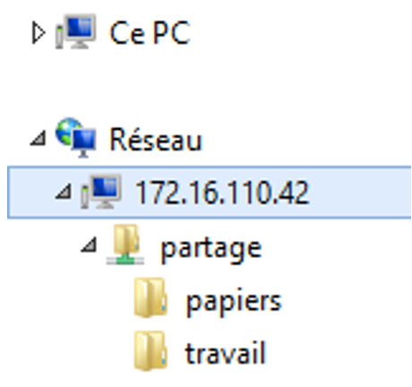

	Voisinnage réseau

Si rien ne s’affiche, cliquer sur le bandeau qui est apparu sous le menu principal de l’Explorateur (indiquant que "La découverte du réseau est désactivée ...") puis accepter d’``Activer la Découverte du réseau`` :

.. _fig-activer-decouverte:

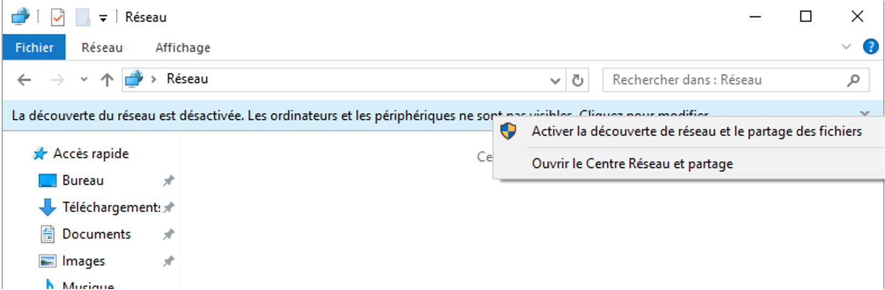

	Notification d’activation de la Découverte du réseau

Il faut également :ref:`activer le service<activer-service>` ``Publication des ressources de découverte de fonctions``. 

.. _activer-service:

Activer le service de ``biométrie Windows``
-------------------------------------------

Dans ``Cortana``, taper ``services`` puis cliquer sur ``Services``. 

Dans la liste, localiser le ``Service de biométrie Windows`` > clic droit > ``Démarrer``

Créer un lecteur réseau ``L``
-----------------------------

Dans l'Explorateur Windows, clic droit sur ``Ce PC`` > ``Connecter un lecteur réseau``

Dans la fenêtre qui s’ouvre, choisir la lettre du lecteur (``L:``) et indiquer le chemin UNC du dossier partagé que l'on souhaite lier au lecteur. Par exemple :

.. code-block:

	\\172.16.110.42\partage

Laisser les autres paramètres par défaut et valider en cliquant sur ``Terminer``.

Placer un ordinateur dans un nouveau groupe de travail
------------------------------------------------------

Dans les :ref:`Informations système générales<infos-syst>`, le nom du groupe de travail actuel est indiqué sous le nom de l’ordinateur. 

Ouvrir la fenêtre de configuration du nom de l’ordinateur (voir :numref:`fig-prop-systeme`), indiquer le nom du nouveau *Groupe de Travail* et valider. 

Redémarrer l'ordinateur (c'est indispensable). 

Se connecter à un compte ``OneDrive``
-------------------------------------

Dans l\’``Explorateur de fichiers``, cliquer sur ``OneDrive`` dans le menu à gauche. 
Indiquer l'adresse email UPEC et le mot de passe du compte. 

.. _fig-onedrive:

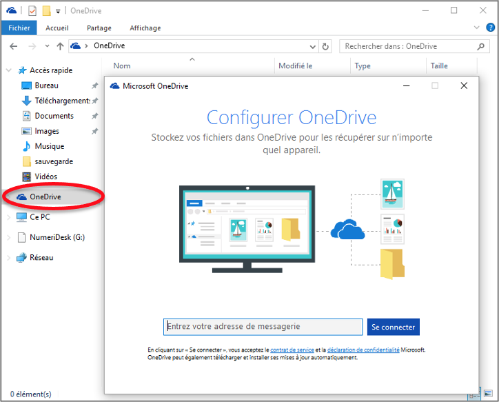

	OneDrive dans l’Explorateur de fichiers

Après l'installation, le dossier de stockage apparaît dans le dossier personnel de l’utilisateur. Il est nommé ``OneDrive – UPEC``

.. warning:: sur un OS antérieur à Windows 10, il est nécessaire d\':ref:`installer-onedrive` avant de pouvoir l'utiliser. 

.. _installer-onedrive:

Installer le client ``OneDrive``
--------------------------------

Pour télécharger le client OneDrive pour Windows, se rendre sur `Microsoft online <https://www.office.com>`_ et s'identifier avec son compte personnel :

Dans la partie ``OneDrive``, cliquer sur le lien ``Obtenir les applications OneDrive`` (lien en bas à gauche) puis télécharger et installer l’application. 

Le client existe également pour ``MacOS``. 

..
	Apple iCloud

.. note:: Si vous ne disposez pas encore de compte Microsoft, vous pouvez utiliser les alternatives telles que Dropbox ou Google Drive !

Se déconnecter de ``OneDrive``
------------------------------

Clic droit sur l’icône ``OneDrive`` dans la *systray* > ``Paramètres`` > ``Supprimer le lien avec cet ordinateur``.

.. _fig-deco-onedrive:

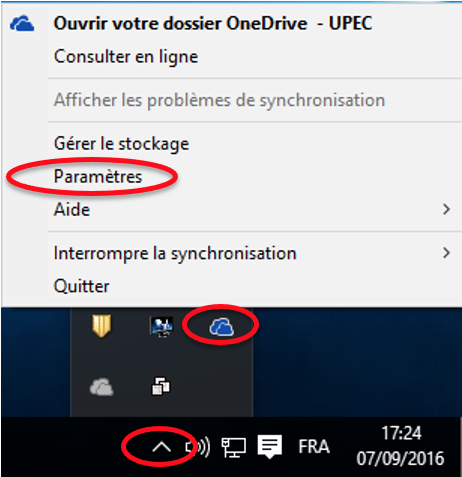

	OneDrive dans la Systray

.. _gestionnaire-taches:

Afficher le ``Gestionnaire des tâches``
---------------------------------------

	``Ctrl + Alt + Suppr`` > ``Gestionnaire des tâches``

ou

	Clic droit sur la ``Barre des Tâches`` > ``Gestionnaire des tâches``

Par défaut, le gestionnaire s'affiche en mode *simplifié*, c'est-à-dire qu'il n’affiche que les applications du système : ce sont les programmes des utilisateurs, possédant une interface graphique ; par exemple, *Firefox* ou *Word*.

Cliquer sur ``Plus de détails`` pour afficher la version complète (:numref:`fig-gestionnaire-taches`).

.. _fig-gestionnaire-taches:

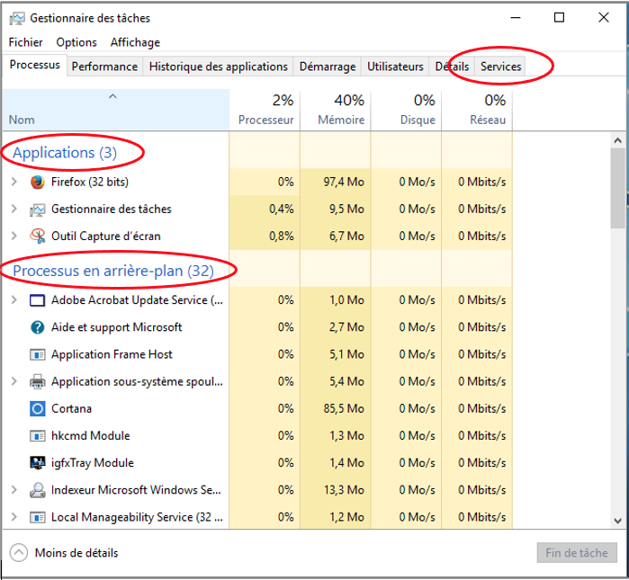

	Gestionnaire des tâches, version complète

..
	Menu Affichage > Sélectionner les colonnes : PID, Threads, Ligne de commande, Description (infos dispo dans le Moniteur de ressources, sauf ligne de commande et description)

Le premier et le dernier onglet donnent la liste des trois types de programmes qui s’exécutent sous Windows :

- ``Applications`` : les programmes avec une interface graphique
- ``Processus en arrière-plan`` et ``Processus Windows`` : les programmes avec ou sans interface graphique (qui tournent en tâche de fond) ; par exemple, ``svhost.exe`` ou ``csrss.exe``
- ``Services`` : fonctionnalités du système d’exploitation s’exécutant avec un niveau de privilège supérieurs aux applications et processus ; par exemple, le ``Pare-feu Windows``

Ouvrir le ``Moniteur de ressources``
------------------------------------

Dans le :ref:`Gestionnaire des tâches<gestionnaire-taches>`, onglet ``Performance``, cliquer sur le lien ``Ouvrir le Moniteur de ressources`` (en bas). 

L'utilisation de chacune des quatre ressources principales de l'ordinateur est détaillée dans un onglet séparé :

- **Processeur** : liste les *processus* du système et leur utilisation du CPU
- **Mémoire** : liste la quantité de mémoire utilisée par chaque processus
- **Disque** : liste les *processus* en train de lire ou écrire sur le disque ; indique aussi l'ensemble des *fichiers* actuellement lus et écrits par les processus du système 
- **Réseau** : liste les processus en train d'envoyer ou de recevoir des données par le réseau

.. _fig-moniteur-ressources:

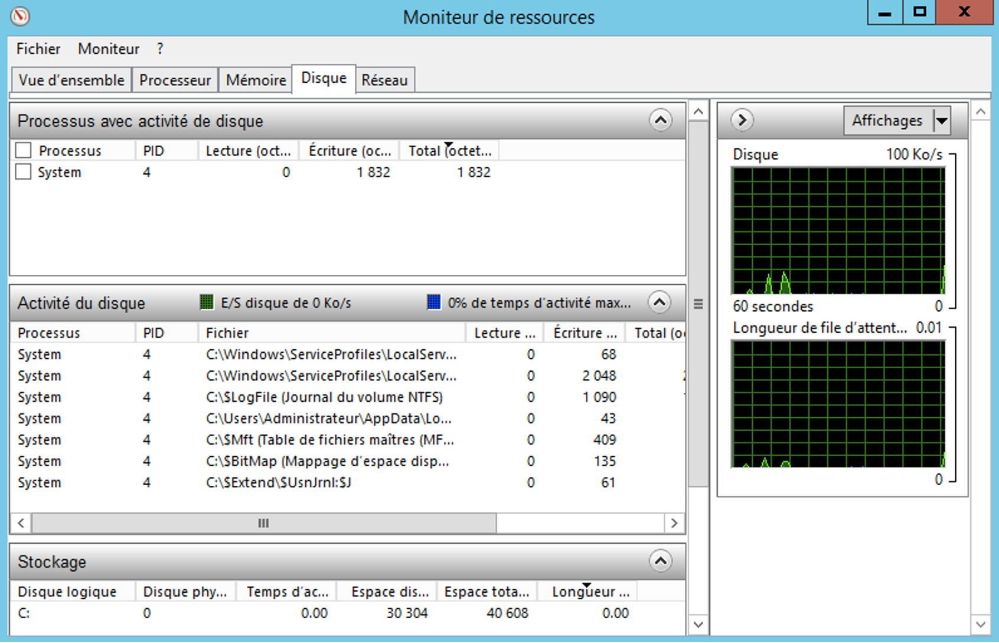

	Moniteurs de ressources

Exécuter un programme en tant qu\'``Administrateur``
----------------------------------------------------

Clic droit sur le programme > ``Exécuter en tant qu’Administrateur``

Créer une tâche planifiée
-------------------------

Dans ``Cortana``, taper tache et cliquer sur ``Planificateur de tâches``.

Dans le panneau de droite du ``Planificateur``, cliquer sur ``Créer une tâche``.

- L'onglet ``Général`` permet de donner un nom à la tâche. Cocher ``N’exécuter que si l’utilisateur est connecté``

- L'onglet ``Déclencheurs`` permet d'indiquer quand la tâche doit être exécutée (cliquer sur ``Nouveau``)

- L'onglet ``Actions`` permet d'indiquer le programme à exécuter (cliquer sur ``Nouveau`` puis indiquer son chemin complet)

.. _fig-planificateur:

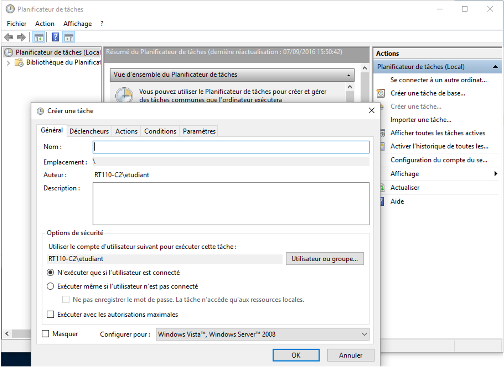

	Planificateur de tâches

Afficher les tâches planifiées
------------------------------

Dans le ``Planificateur des tâches``, cliquer sur ``Bibliothèques du Planificateur``.

Afficher l'Observateur d'évènements
-----------------------------------

Dans ``Cortana``, taper ``evenem`` et cliquer sur le lien ``Observateur d’évènements`` qui apparaît. 

L'interface graphique est composée de plusieurs volets :

#. A gauche, la liste des journaux

#. Au centre, la liste des évènements du journal sélectionné, avec leur intitulé, date et heure, numéro d'identification (ID), etc

#. Les détails d'un évènement particulier, obtenu par un double-clic sur celui-ci

#. A droite, les actions qui peuvent être effectuées sur le journal ou l'évènement sélectionné

..
	Tache planifiée lié à un evt ! testé, marche pas

.. _fig-observateur-evts:

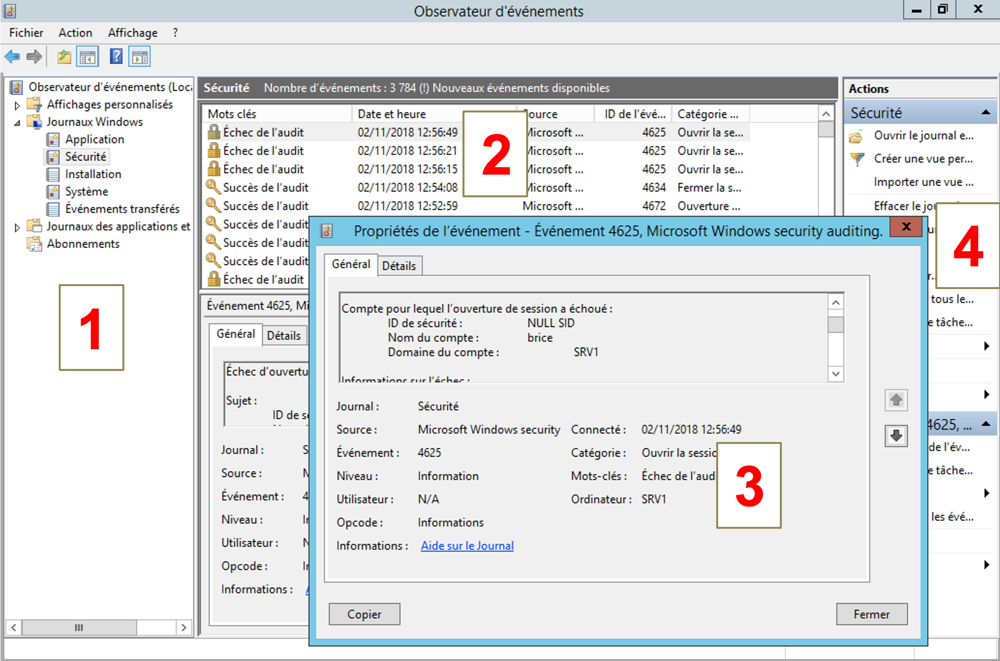

	Observateur d'évènements

Créer une vue personnalisée dans l'Observateur d'évènements
-----------------------------------------------------------

Dans l\'``Observateur d'évènements``, cliquer sur ``Créer une vue personnalisée`` dans le volet de droite. 

Dans la fenêtre qui s'affiche, sélectionner :

- ``Connecté`` : il s'agit de la plage horaire à laquelle on s'intéresse (les dernières 24 heures, les 30 derniers jours, etc.)
- ``Par source`` : cocher les noms des sources des évènements auxquels on s'intéresse
- Laisser les autres paramètres par défaut
- Valider, puis choisir le nom de la nouvelle vue

Après validation, la vue personnalisée apparait dans le volet de gauche :

.. _fig-observateur-vue:

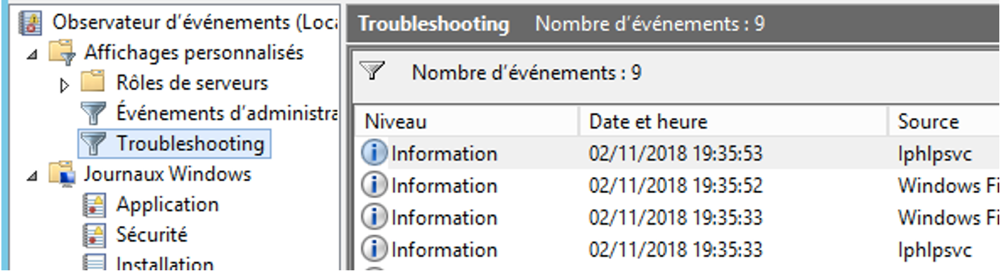

	Vue personnalisée

.. _ajouter-poste:

..
	TODO refaire screenshot avec heisenberg.org

Ajouter un poste au domaine ``ad2016.local``
--------------------------------------------

Dans la fenêtre des :ref:`propriétés système<infos-syst>` (:numref:`fig-prop-systeme`), sélectionner ``Domaine``, indiquer le nom du domaine (``ad2016.local``) et valider. 

Entrer les identifiants d'un compte ayant les droits ``Administrateur`` **sur le domaine**. 

Si l'ajout s’est bien passé, un message de "Bienvenue" apparaît :

.. _fig-bienvenue-ad:

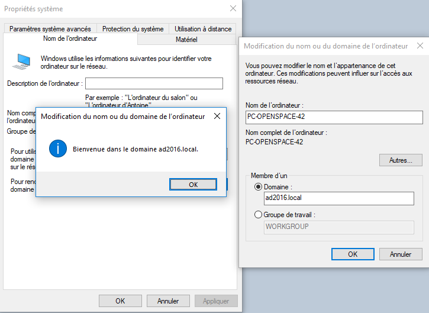

	Ajout d'un poste dans le domaine

Accepter le redémarrage pour finaliser l’ajout dans le domaine.

Ouvrir une session sur le domaine
---------------------------------

Dans la GINA (écran d'ouverture de session), cliquer sur Autre utilisateur (en bas à gauche) puis indiquer les identifiants. 

.. _fig-gina:

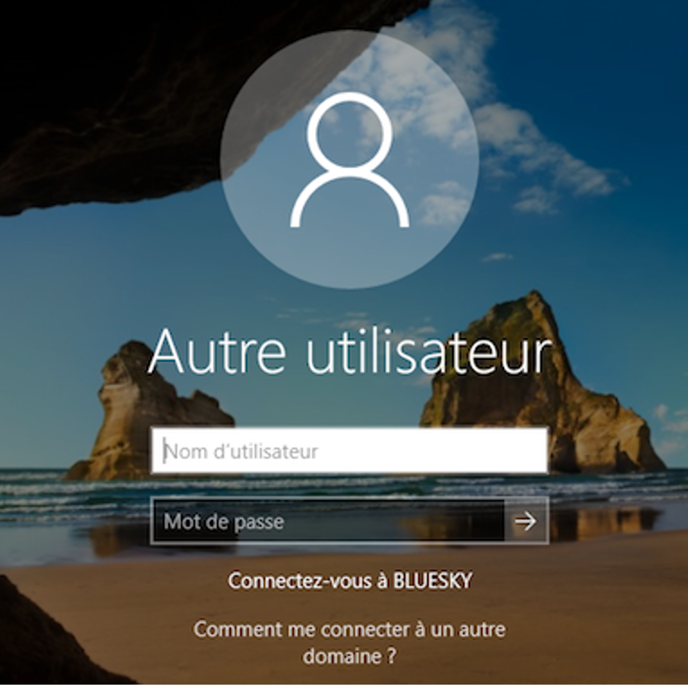

	GINA

.. note:: Le poste doit déjà être :ref:`ajouté au domaine<ajouter-poste>`.

Activer le bureau à distance
----------------------------

Dans la fenêtre des :ref:`Informations système générales<infos-syst>`, cliquer sur ``Paramètres d'utilisation à distance``. 

Cocher ``Autoriser les connexions à distance à cet ordinateur``.

Démarrer une session Bureau à distance vers ``PC-DE-MALOTRU``
-------------------------------------------------------------

Dans ``Cortana``, taper ``Bureau`` puis cliquer sur ``Bureau à distance``. 

Entrer le nom de l'ordinateur distant. 

.. _fig-remote-desktop:

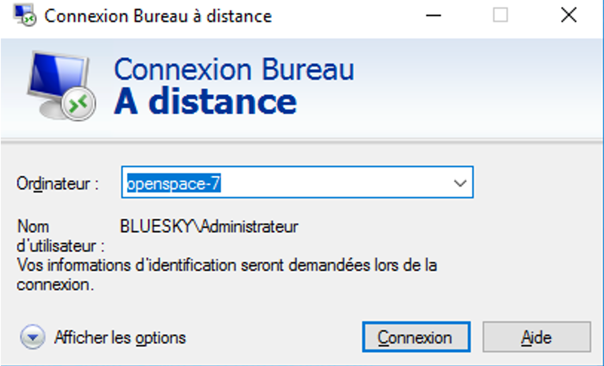

	Connexion Bureau à distance

Le bandeau suivant permet de s'assurer que la connexion distante est établie. 

.. _fig-bandeau-remote-desktop:

	Bandeau en haut du Bureau à distance

.. note:: L'établissement de la connexion peut prendre plusieurs dizaines de secondes ...

.. _fig-remote-desktop-encours:

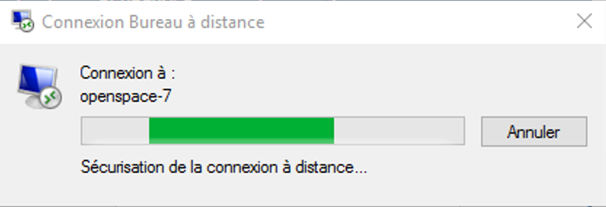

	Connexion Bureau à distance en cours

Forcer l'application des GPO sur un poste
-----------------------------------------

.. code-block::

	gpupdate /force 

Lister les GPO appliquées sur un poste
--------------------------------------

.. code-block::

	gpresult /v

Régler la date et l'heure
-------------------------

``Panneau de configuration`` > ``Horloge et Région`` > ``Définir date et heure`` > Onglet ``Temps internet`` > ``Modifier les paramètres`` > ``Mettre à jour``

