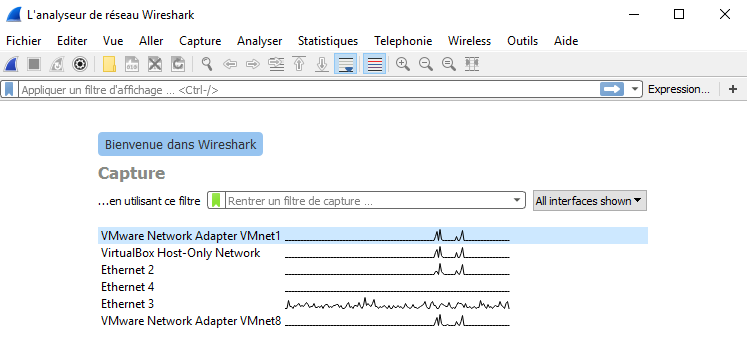
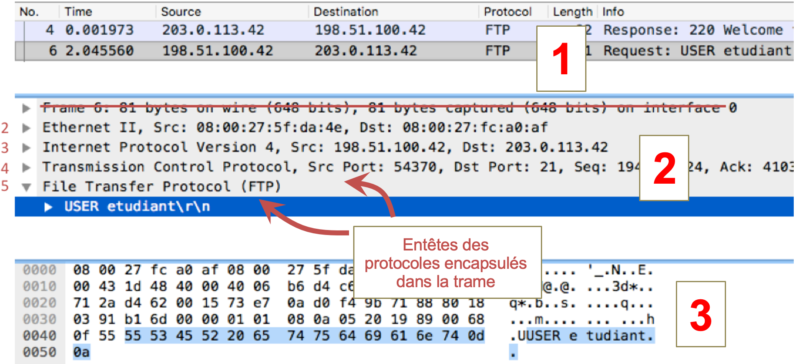
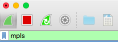
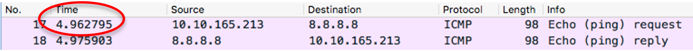
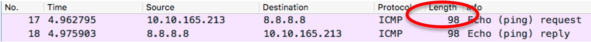
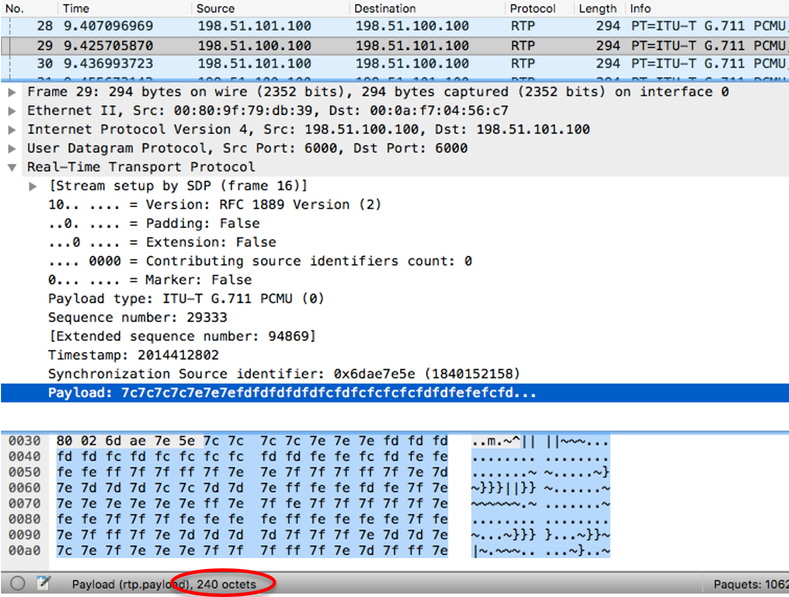
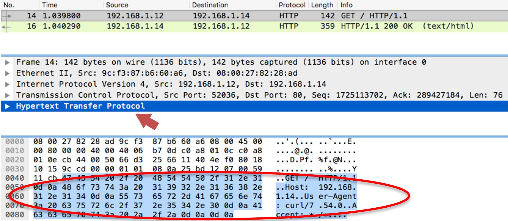

WireShark
=========

Lancer une capture de trafic sur la carte ``Ethernet 3``
--------------------------------------------------------

La fenêtre d'accueil de ``Wireshark`` liste les cartes réseau :

.. _fig-wireshark-capture:

	Accueil de Wireshark

Double-cliquer sur ``Ethernet 3`` dans la liste. La capture démarre. 

Organisation de la GUI de ``Wireshark``
---------------------------------------

La fenêtre est divisée en trois cadres :

#. **Liste des trames capturées.** Wireshark capture les trames au niveau de la couche 2 (``Liaison de données``). Les trames sont affichées au fur et à mesure de leur capture, avec leurs caractéristiques essentielles : numéro de trame, heure de capture, taille etc. 

#. **Analyse de la trame sélectionnée.** Chaque ligne (sauf la première) représente l'entête d'un des protocoles encapsulés dans la trame, en commençant par la couche 2 et en remontant dans les couches. Par exemple, la trame sélectionnée dans la Fig. 56 contient les protocoles ``Ethernet II`` (couche 2), ``IPv4`` (couche 3), ``TCP`` (couche 4) et ``FTP`` (couche 5). Il est possible de développer chacune de ces lignes pour visualiser les champs de l'entête et leur valeur. 

#. **Contenu brut de la trame sélectionnée.** Chaque octet est représenté en hexadécimal et en ASCII. 

.. _fig-wireshark-panneaux:

	Wireshark pendant une capture de trafic

Ajouter un filtre sur le protocole ``mpls``
-------------------------------------------

Dans la zone de filtre, entrer ``mpls`` puis valider avec ``Entrée`` :

.. _fig-wireshark-filtre-mpls:

	Filtre Wireshark

A partir de maintenant, l'analyseur affichera uniquement les messages de ce protocole.

Déterminer l'heure de capture de la trame 17
--------------------------------------------

La colonne ``Time`` indique l'heure de la capture (par rapport au début de la capture) à la microseconde près. 

.. _fig-wireshark-heure:

Dans cet exemple, la trame a été capturée 4 secondes et 962 millièmes après le début de la capture. 

Déterminer la taille totale de la trame 17
------------------------------------------

La colonne ``Length`` indique la taille en octets. 

.. _fig-wireshark-longueur:

Afficher la taille des données contenues dans la trame 29
---------------------------------------------------------

..
	Préciser : RTP ?
	Plus spécifique que la précédente (taille totale)

Cliquer sur la trame 29, développer l'entête ``Real-Time Transport Protocol`` puis cliquer sur le champ ``Payload``. La taille s'affiche dans la barre de statut. 

.. _fig-wireshark-taille-data:

Sélectionner l'entête de la couche ``Application`` dans la trame 14
-------------------------------------------------------------------

Cliquer sur la trame 14, puis sur l'entête de la couche ``Application`` dans le volet central. Dans l'exemple de la :numref:`fig-wireshark-entete-http`, il s'agit de ``HTTP``. 

.. note:: Dans le volet inférieur, les octets correspondant à cet entête sont surlignés en bleu. 

.. _fig-wireshark-entete-http:

	Sélection de l'entête HTTP dans la trame 14